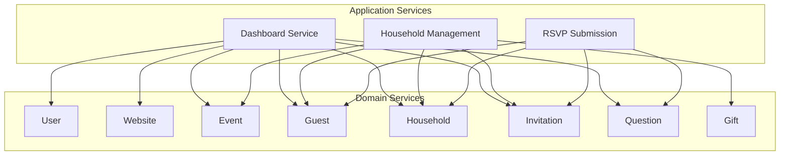
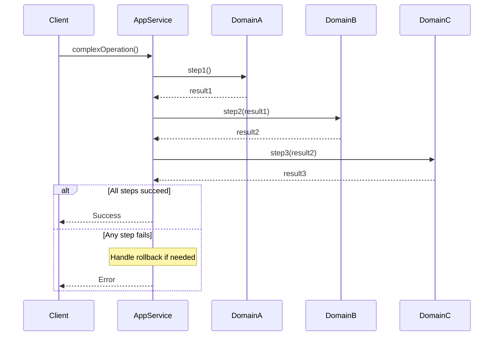

# Application Services Documentation

## Overview

Application Services orchestrate multiple domain services for complex workflows that span domain boundaries. They coordinate transactions, aggregate data, and provide unified APIs for complex operations.

---

## Service List

| Service | Description | Documentation |
|---------|-------------|---------------|
| [Dashboard](./dashboard.md) | Aggregate overview data | Statistics, summaries |
| [Household Management](./household-management.md) | Complex household operations | Create/update with guests |
| [RSVP Submission](./rsvp-submission.md) | Guest RSVP workflow | Complete RSVP flow |

---

## Architecture



---

## When to Use Application Services

### Use Application Services When:
- Operation spans multiple domains
- Need to coordinate transactions
- Aggregating data from multiple sources
- Complex business workflows

### Use Domain Services When:
- Operation is within single domain
- Simple CRUD operations
- Domain-specific business logic

---

## Service Pattern

```typescript
// application/{service}/{service}.service.ts
export class MyApplicationService {
  constructor(
    private domainServiceA: DomainServiceA,
    private domainServiceB: DomainServiceB,
  ) {}

  async complexOperation(input: Input): Promise<Result> {
    // 1. Call domain service A
    const resultA = await this.domainServiceA.operation()

    // 2. Call domain service B with result from A
    const resultB = await this.domainServiceB.operation(resultA.id)

    // 3. Return aggregated result
    return { ...resultA, ...resultB }
  }
}
```

---

## Folder Structure

```
src/server/application/
├── dashboard/
│   ├── dashboard.service.ts    # Orchestration logic
│   ├── dashboard.router.ts     # tRPC procedures
│   ├── dashboard.types.ts      # Composite types
│   └── index.ts                # Barrel export
│
├── household-management/
│   ├── household-management.service.ts
│   ├── household-management.router.ts
│   ├── household-management.types.ts
│   ├── household-management.validator.ts
│   └── index.ts
│
├── rsvp-submission/
│   ├── rsvp-submission.service.ts
│   ├── rsvp-submission.router.ts
│   ├── rsvp-submission.types.ts
│   ├── rsvp-submission.validator.ts
│   └── index.ts
│
└── index.ts                    # Barrel export for all services
```

---

## Rules

### Application Services Can:
- Call multiple domain services
- Coordinate transactions
- Aggregate data from multiple domains
- Handle cross-domain business workflows

### Application Services Cannot:
- Contain domain business logic
- Access repositories directly
- Bypass domain service validation
- Call other application services

---

## Transaction Handling

Application services coordinate multi-step operations:



---

## Testing Application Services

```typescript
describe('HouseholdManagementService', () => {
  const mockHouseholdService = {
    create: jest.fn(),
    update: jest.fn(),
  }
  const mockGuestService = {
    createMany: jest.fn(),
  }
  const mockInvitationService = {
    createForGuests: jest.fn(),
  }

  const service = new HouseholdManagementService(
    mockHouseholdService,
    mockGuestService,
    mockInvitationService,
  )

  it('should create household with guests', async () => {
    mockHouseholdService.create.mockResolvedValue({ id: 'hh-1' })
    mockGuestService.createMany.mockResolvedValue([{ id: 1 }])

    const result = await service.createWithGuests(...)

    expect(mockHouseholdService.create).toHaveBeenCalled()
    expect(mockGuestService.createMany).toHaveBeenCalled()
  })
})
```
