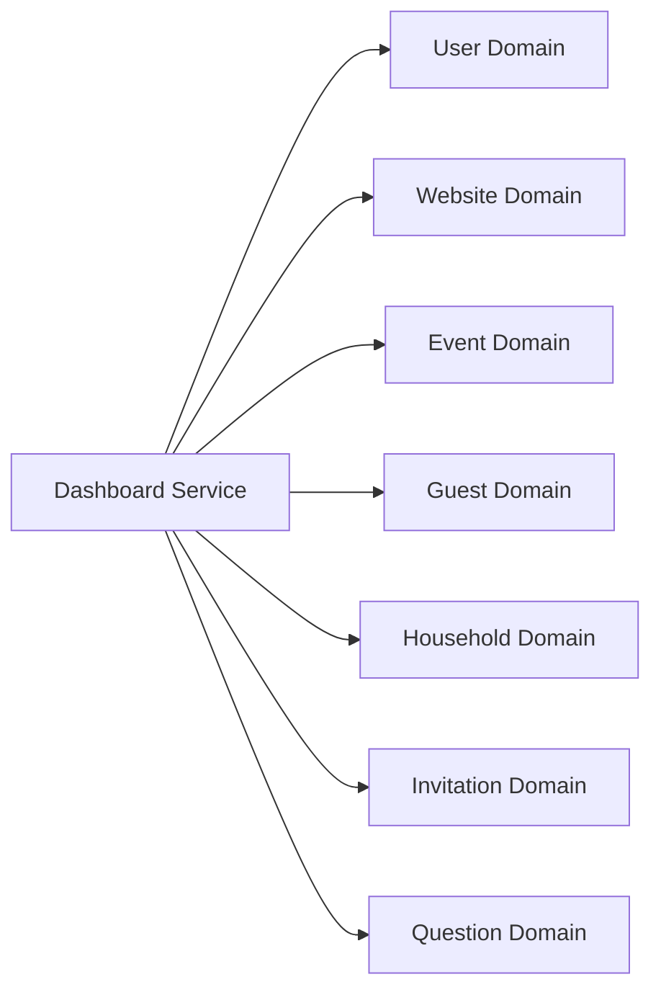
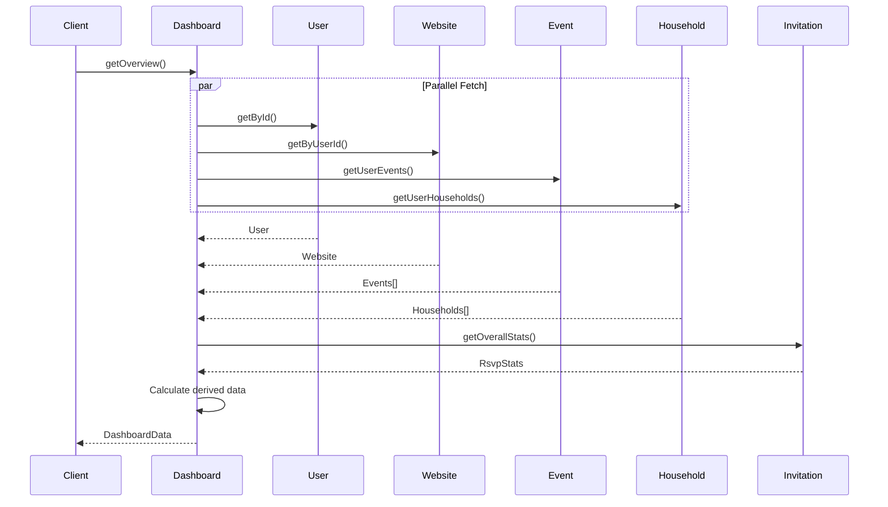
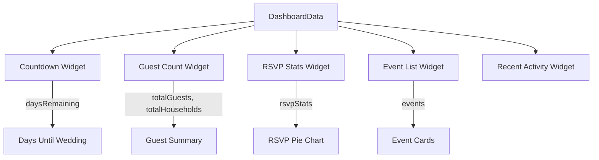

# Dashboard Service

## Overview

The Dashboard Service aggregates data from multiple domains to provide a comprehensive overview of the wedding planning status. It powers the main dashboard view with statistics, counts, and summaries.

---

## Orchestrates



---

## Operations

| Operation | Procedure | Description |
|-----------|-----------|-------------|
| Get Overview | `dashboard.getOverview` | Complete dashboard data |
| Get Wedding Data | `dashboard.getWeddingData` | Wedding details for guests |

---

## Types

```typescript
export type DashboardData = {
  user: {
    groomFirstName: string | null
    groomLastName: string | null
    brideFirstName: string | null
    brideLastName: string | null
  }
  website: Website | null
  events: EventWithStats[]
  households: HouseholdWithGuests[]
  stats: {
    totalGuests: number
    totalHouseholds: number
    daysRemaining: number | null
  }
  rsvpStats: RsvpStats
}

export type WeddingData = {
  website: WebsiteWithQuestions
  events: EventWithStats[]
  generalQuestions: QuestionWithOptions[]
}

export type WeddingDate = {
  eventId: string
  eventName: string
  date: Date
  daysRemaining: number
}
```

---

## Data Flow

### Dashboard Overview



---

## API Reference

### dashboard.getOverview

Get complete dashboard overview for the authenticated user.

**Type:** Query (Protected)

**Response:**
```typescript
{
  user: {
    groomFirstName: string | null
    groomLastName: string | null
    brideFirstName: string | null
    brideLastName: string | null
  }
  website: Website | null
  events: EventWithStats[]
  households: HouseholdWithGuests[]
  stats: {
    totalGuests: number
    totalHouseholds: number
    daysRemaining: number | null
  }
  rsvpStats: {
    total: number
    notInvited: number
    invited: number
    attending: number
    declined: number
  }
}
```

### dashboard.getWeddingData

Get wedding data for the public wedding page.

**Type:** Query (Public)

**Input:**
```typescript
{ subUrl: string }
```

**Response:**
```typescript
{
  website: WebsiteWithQuestions
  events: EventWithStats[]
  generalQuestions: QuestionWithOptions[]
}
```

---

## Calculated Statistics

### Days Remaining

```typescript
function calculateDaysRemaining(events: Event[]): number | null {
  const mainEvent = events.find(e =>
    e.name.toLowerCase().includes('ceremony') ||
    e.name.toLowerCase().includes('wedding')
  )

  if (!mainEvent?.date) return null

  const today = new Date()
  const eventDate = new Date(mainEvent.date)
  const diffTime = eventDate.getTime() - today.getTime()
  const diffDays = Math.ceil(diffTime / (1000 * 60 * 60 * 24))

  return diffDays
}
```

### Guest Counts

```typescript
function calculateGuestCounts(households: HouseholdWithGuests[]): number {
  return households.reduce(
    (sum, household) => sum + household.guests.length,
    0
  )
}
```

### RSVP Response Rate

```typescript
function calculateResponseRate(stats: RsvpStats): number {
  const responded = stats.attending + stats.declined
  const total = stats.invited + stats.attending + stats.declined

  if (total === 0) return 0
  return (responded / total) * 100
}
```

---

## Dashboard Widgets

The dashboard data powers several UI widgets:



---

## Usage Examples

### Load Dashboard

```typescript
const dashboard = await trpc.dashboard.getOverview.query()

// Display countdown
if (dashboard.stats.daysRemaining !== null) {
  console.log(`${dashboard.stats.daysRemaining} days until the wedding!`)
}

// Display guest stats
console.log(`${dashboard.stats.totalGuests} guests`)
console.log(`${dashboard.stats.totalHouseholds} households`)

// Display RSVP stats
const { attending, declined, invited } = dashboard.rsvpStats
console.log(`${attending} attending, ${declined} declined, ${invited} pending`)
```

### Load Wedding Page Data

```typescript
const weddingData = await trpc.dashboard.getWeddingData.query({
  subUrl: 'john-and-jane'
})

// Render wedding page
const { website, events, generalQuestions } = weddingData
```

---

## Performance Considerations

The dashboard aggregates data from multiple sources. To optimize:

1. **Parallel Fetching** - User, website, events, and households are fetched in parallel
2. **Minimal Data** - Only necessary fields are selected
3. **Caching** - Consider caching for frequently accessed data
4. **Pagination** - Household list may need pagination for large guest lists

---

## Related Services

- **[Household Management](./household-management.md)** - Modify households
- **[RSVP Submission](./rsvp-submission.md)** - Process RSVP responses
