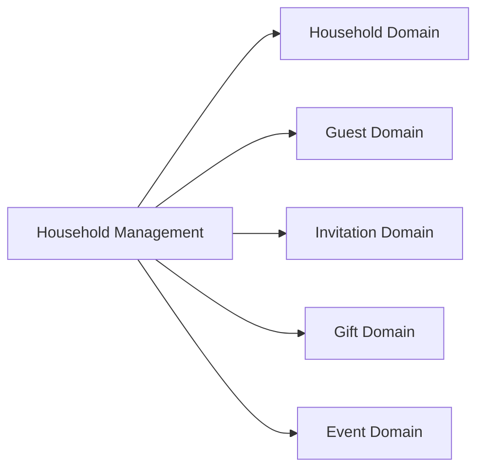
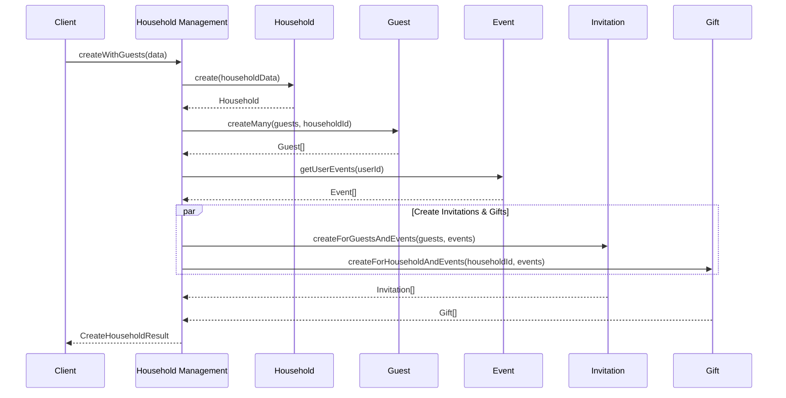
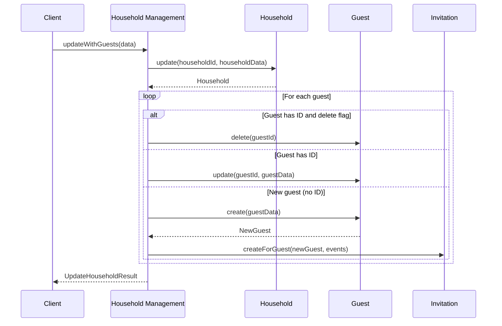

# Household Management Service

## Overview

The Household Management Service handles complex household operations that span multiple domains. It coordinates creating households with guests, managing invitations, and tracking gifts.

---

## Orchestrates



---

## Operations

| Operation | Procedure | Description |
|-----------|-----------|-------------|
| Create with Guests | `householdManagement.createWithGuests` | Create household with guests and invitations |
| Update with Guests | `householdManagement.updateWithGuests` | Update household, add/remove guests |
| Delete | `householdManagement.delete` | Delete household and all related data |

---

## Types

```typescript
export type CreateHouseholdWithGuestsInput = {
  household: {
    address1?: string
    address2?: string
    city?: string
    state?: string
    zipCode?: string
    country?: string
    phone?: string
    email?: string
    notes?: string
  }
  guests: {
    firstName: string
    lastName: string
    isPrimaryContact: boolean
  }[]
}

export type UpdateHouseholdWithGuestsInput = {
  householdId: string
  household: {
    address1?: string
    city?: string
    state?: string
    zipCode?: string
    phone?: string
    email?: string
    notes?: string
  }
  guests: {
    id?: number  // Existing guest ID (omit for new guests)
    firstName: string
    lastName: string
    isPrimaryContact: boolean
    delete?: boolean  // Flag to delete this guest
  }[]
  gifts?: {
    eventId: string
    description?: string
    thankyou?: boolean
  }[]
}

export type CreateHouseholdResult = {
  household: Household
  guests: Guest[]
  invitations: Invitation[]
  gifts: Gift[]
}
```

---

## Data Flow

### Create Household with Guests



### Update Household with Guests



---

## API Reference

### householdManagement.createWithGuests

Create a new household with guests, automatically creating invitations for all events.

**Type:** Mutation (Protected)

**Input:**
```typescript
{
  household: {
    address1?: string
    address2?: string
    city?: string
    state?: string
    zipCode?: string
    country?: string
    phone?: string
    email?: string
    notes?: string
  }
  guests: {
    firstName: string
    lastName: string
    isPrimaryContact: boolean
  }[]
}
```

**Response:**
```typescript
{
  household: Household
  guests: Guest[]
  invitations: Invitation[]
  gifts: Gift[]
}
```

### householdManagement.updateWithGuests

Update household and manage guests (add, update, delete).

**Type:** Mutation (Protected)

**Input:**
```typescript
{
  householdId: string
  household: {
    address1?: string
    city?: string
    state?: string
    zipCode?: string
    phone?: string
    email?: string
    notes?: string
  }
  guests: {
    id?: number
    firstName: string
    lastName: string
    isPrimaryContact: boolean
    delete?: boolean
  }[]
  gifts?: {
    eventId: string
    description?: string
    thankyou?: boolean
  }[]
}
```

### householdManagement.delete

Delete a household and all related data.

**Type:** Mutation (Protected)

**Input:**
```typescript
{ householdId: string }
```

---

## Business Logic

### Auto-Invitation Creation

When a household is created, invitations are automatically created for all guests for all events:

```typescript
async createWithGuests(userId: string, input: CreateHouseholdWithGuestsInput) {
  // 1. Create household
  const household = await this.householdService.create(userId, input.household)

  // 2. Create guests
  const guests = await this.guestService.createMany(
    input.guests.map(g => ({
      ...g,
      householdId: household.id,
      userId,
    }))
  )

  // 3. Get all user events
  const events = await this.eventService.getUserEvents(userId)

  // 4. Create invitations for each guest × event combination
  const invitations = await this.invitationService.createForGuestsAndEvents(
    guests,
    events,
    userId
  )

  // 5. Create gift tracking records
  const gifts = await this.giftService.createForHouseholdAndEvents(
    household.id,
    events
  )

  return { household, guests, invitations, gifts }
}
```

### Guest Management

When updating a household, the service handles guest changes:

| Action | Criteria | Result |
|--------|----------|--------|
| Update | Has `id`, no `delete` | Update existing guest |
| Delete | Has `id` and `delete: true` | Delete guest and invitations |
| Create | No `id` | Create new guest and invitations |

---

## Validation Schema

```typescript
export const createHouseholdWithGuestsSchema = z.object({
  household: z.object({
    address1: z.string().optional(),
    address2: z.string().optional(),
    city: z.string().optional(),
    state: z.string().optional(),
    zipCode: z.string().optional(),
    country: z.string().optional(),
    phone: z.string().optional(),
    email: z.string().email().optional(),
    notes: z.string().optional(),
  }),
  guests: z.array(z.object({
    firstName: z.string().min(1),
    lastName: z.string().min(1),
    isPrimaryContact: z.boolean(),
  })).min(1, 'At least one guest required'),
})
```

---

## Usage Examples

### Create Household

```typescript
const result = await trpc.householdManagement.createWithGuests.mutate({
  household: {
    address1: '123 Main St',
    city: 'New York',
    state: 'NY',
    zipCode: '10001',
    email: 'smith@email.com',
  },
  guests: [
    { firstName: 'John', lastName: 'Smith', isPrimaryContact: true },
    { firstName: 'Jane', lastName: 'Smith', isPrimaryContact: false },
  ],
})

console.log(`Created household with ${result.guests.length} guests`)
console.log(`Created ${result.invitations.length} invitations`)
```

### Update Household (Add Guest)

```typescript
await trpc.householdManagement.updateWithGuests.mutate({
  householdId: 'household-id',
  household: {
    phone: '555-1234',
  },
  guests: [
    // Existing guests (with IDs)
    { id: 1, firstName: 'John', lastName: 'Smith', isPrimaryContact: true },
    { id: 2, firstName: 'Jane', lastName: 'Smith', isPrimaryContact: false },
    // New guest (no ID)
    { firstName: 'Jimmy', lastName: 'Smith', isPrimaryContact: false },
  ],
})
```

### Update Household (Remove Guest)

```typescript
await trpc.householdManagement.updateWithGuests.mutate({
  householdId: 'household-id',
  household: {},
  guests: [
    { id: 1, firstName: 'John', lastName: 'Smith', isPrimaryContact: true },
    { id: 2, firstName: 'Jane', lastName: 'Smith', isPrimaryContact: false, delete: true },
  ],
})
```

### Delete Household

```typescript
await trpc.householdManagement.delete.mutate({
  householdId: 'household-id'
})
```

---

## Related Services

- **[Dashboard](./dashboard.md)** - View household data
- **[RSVP Submission](./rsvp-submission.md)** - Guest RSVPs
