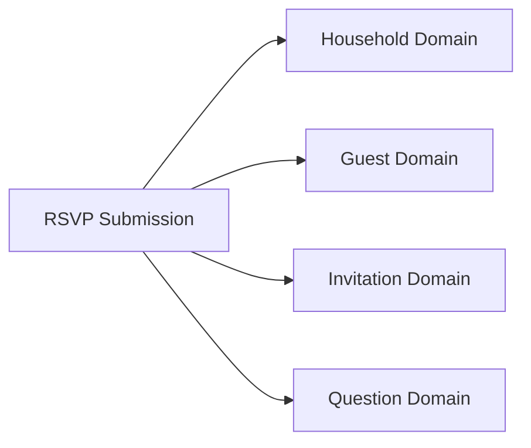
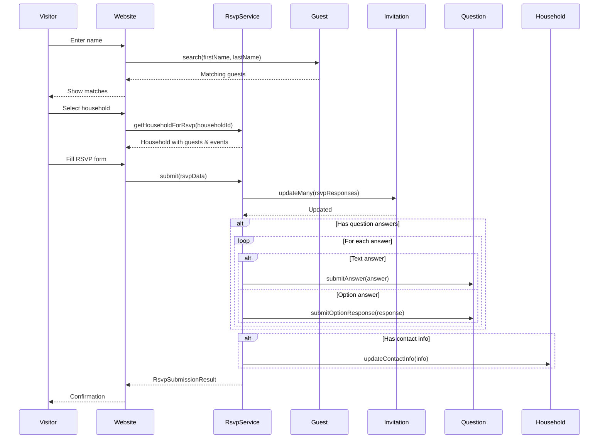
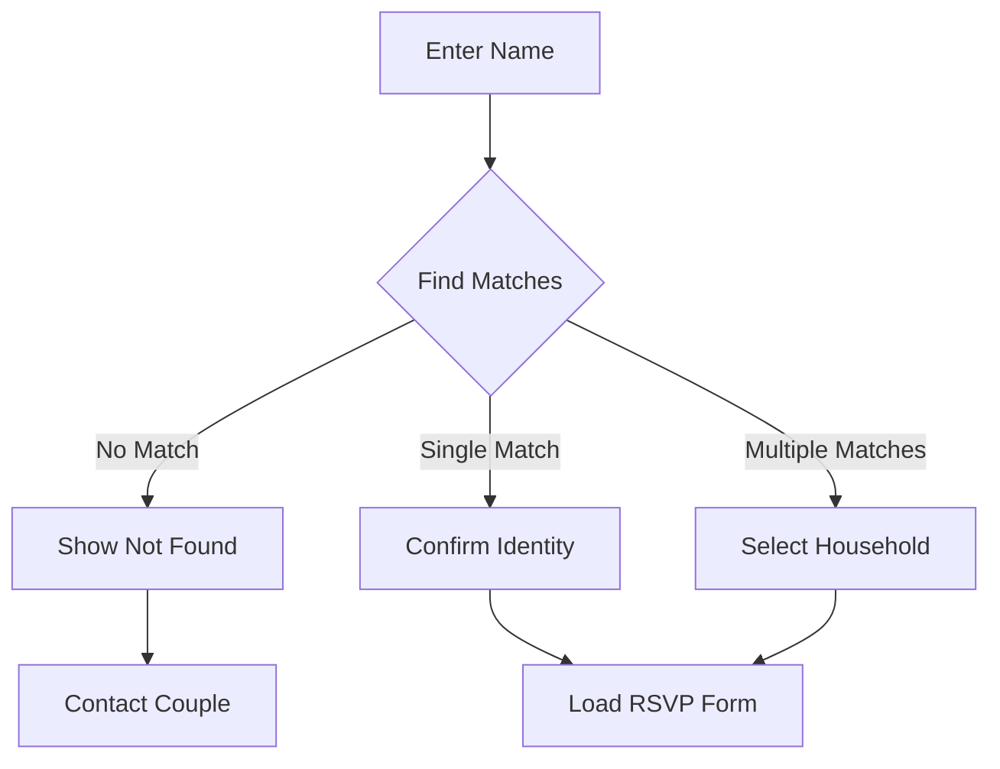
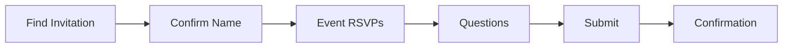

# RSVP Submission Service

## Overview

The RSVP Submission Service handles the complete guest RSVP workflow from the public wedding website. It coordinates finding guests, updating RSVP statuses, and submitting question responses.

---

## Orchestrates



---

## Operations

| Operation | Procedure | Description |
|-----------|-----------|-------------|
| Submit RSVP | `rsvpSubmission.submit` | Complete RSVP submission |

---

## Types

```typescript
export type RsvpSubmissionInput = {
  householdId: string
  rsvpResponses: RsvpResponse[]
  questionAnswers?: AnswerToQuestion[]
  contactInfo?: {
    email?: string
    phone?: string
  }
}

export type RsvpResponse = {
  guestId: number
  eventId: string
  rsvp: 'Attending' | 'Declined'
}

export type AnswerToQuestion = {
  questionId: string
  guestId: number
  householdId: string
  response?: string        // For text questions
  optionId?: string        // For option questions
}

export type RsvpSubmissionResult = {
  success: boolean
  householdId: string
  updatedInvitations: number
  submittedAnswers: number
}
```

---

## RSVP Flow



---

## API Reference

### rsvpSubmission.submit

Submit complete RSVP for a household.

**Type:** Mutation (Public)

**Input:**
```typescript
{
  householdId: string
  rsvpResponses: {
    guestId: number
    eventId: string
    rsvp: 'Attending' | 'Declined'
  }[]
  questionAnswers?: {
    questionId: string
    guestId: number
    householdId: string
    response?: string
    optionId?: string
  }[]
  contactInfo?: {
    email?: string
    phone?: string
  }
}
```

**Response:**
```typescript
{
  success: boolean
  householdId: string
  updatedInvitations: number
  submittedAnswers: number
}
```

---

## Guest Search Flow

Before submitting RSVP, guests find their invitation:



---

## RSVP Form Steps



### Step Details

| Step | Description | Data Collected |
|------|-------------|----------------|
| Find Invitation | Search by name | Guest identity |
| Confirm Name | Verify correct household | Household confirmation |
| Event RSVPs | Select attending/declined per event | RsvpResponse[] |
| Questions | Answer event and general questions | AnswerToQuestion[] |
| Submit | Review and submit | Contact info (optional) |

---

## Validation Schema

```typescript
export const submitRsvpSchema = z.object({
  householdId: z.string().uuid(),
  rsvpResponses: z.array(z.object({
    guestId: z.number(),
    eventId: z.string().uuid(),
    rsvp: z.enum(['Attending', 'Declined']),
  })),
  questionAnswers: z.array(z.object({
    questionId: z.string().uuid(),
    guestId: z.number(),
    householdId: z.string().uuid(),
    response: z.string().optional(),
    optionId: z.string().uuid().optional(),
  })).optional(),
  contactInfo: z.object({
    email: z.string().email().optional(),
    phone: z.string().optional(),
  }).optional(),
})
```

---

## Business Rules

1. **Guest verification** - Only valid guest/household combinations accepted
2. **Required questions** - Required questions must have answers
3. **Valid RSVP status** - Only 'Attending' or 'Declined' accepted
4. **Single submission** - Subsequent submissions update previous responses
5. **Contact info update** - Optional contact info updates household record

---

## Error Handling

| Error | Cause | Resolution |
|-------|-------|------------|
| `HOUSEHOLD_NOT_FOUND` | Invalid household ID | Restart RSVP flow |
| `GUEST_NOT_IN_HOUSEHOLD` | Guest doesn't belong to household | Verify guest selection |
| `REQUIRED_QUESTION_MISSING` | Required question not answered | Complete all required fields |
| `INVALID_EVENT` | Event doesn't exist | Refresh and retry |

---

## Usage Examples

### Complete RSVP Submission

```typescript
const result = await trpc.rsvpSubmission.submit.mutate({
  householdId: 'household-id',
  rsvpResponses: [
    { guestId: 1, eventId: 'ceremony-id', rsvp: 'Attending' },
    { guestId: 1, eventId: 'reception-id', rsvp: 'Attending' },
    { guestId: 2, eventId: 'ceremony-id', rsvp: 'Attending' },
    { guestId: 2, eventId: 'reception-id', rsvp: 'Declined' },
  ],
  questionAnswers: [
    {
      questionId: 'dietary-question-id',
      guestId: 1,
      householdId: 'household-id',
      optionId: 'vegetarian-option-id',
    },
    {
      questionId: 'song-request-id',
      guestId: 1,
      householdId: 'household-id',
      response: 'Dancing Queen by ABBA',
    },
  ],
  contactInfo: {
    email: 'updated@email.com',
    phone: '555-9999',
  },
})

if (result.success) {
  console.log('RSVP submitted successfully!')
  console.log(`Updated ${result.updatedInvitations} invitations`)
  console.log(`Submitted ${result.submittedAnswers} question answers`)
}
```

### Simple RSVP (No Questions)

```typescript
await trpc.rsvpSubmission.submit.mutate({
  householdId: 'household-id',
  rsvpResponses: [
    { guestId: 1, eventId: 'event-id', rsvp: 'Attending' },
  ],
})
```

---

## Frontend Integration

The RSVP submission service integrates with a multi-step form:

```typescript
// Step 1: Find guest
const guests = await trpc.guest.search.query({
  firstName,
  lastName,
  websiteId,
})

// Step 2: Load household data
const household = await trpc.household.getById.query({
  id: selectedHouseholdId,
})

// Step 3: Load questions
const eventQuestions = await trpc.question.getByEventId.query({
  eventId: selectedEventId,
})
const generalQuestions = await trpc.question.getByWebsiteId.query({
  websiteId,
})

// Step 4: Submit
const result = await trpc.rsvpSubmission.submit.mutate({
  householdId,
  rsvpResponses,
  questionAnswers,
})
```

---

## Related Services

- **[Dashboard](./dashboard.md)** - View RSVP statistics
- **[Household Management](./household-management.md)** - Manage households
