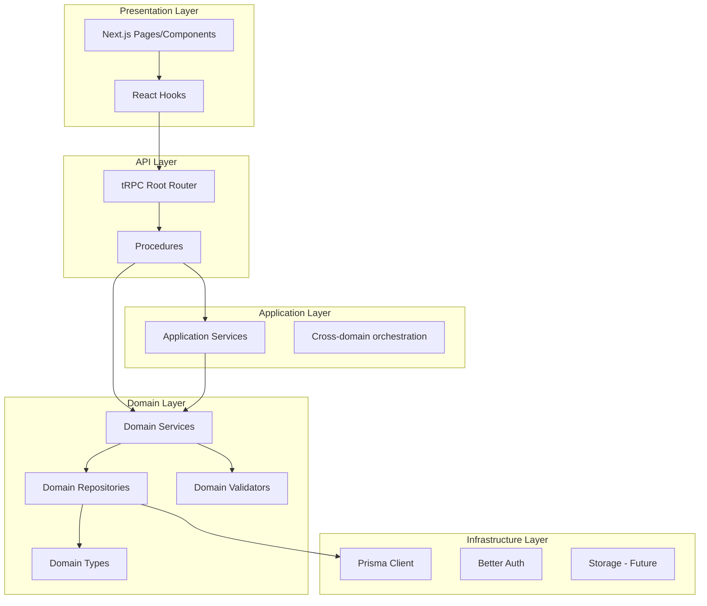
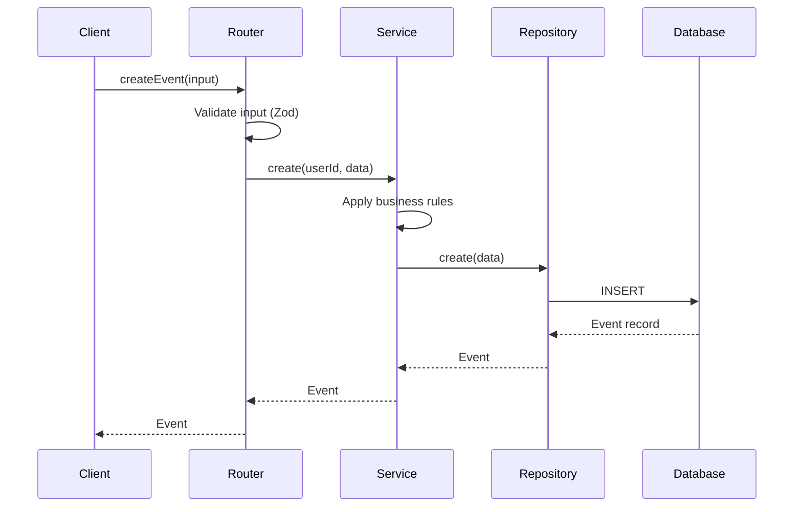
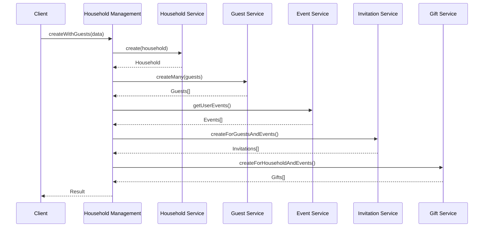
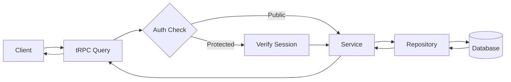
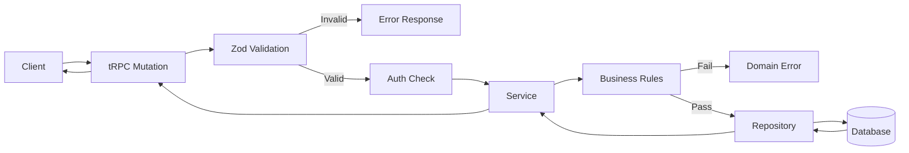

# Architecture Overview

## Design Philosophy

OSWP follows a **domain-driven architecture** with clear separation of concerns using the Application Layer pattern. This architecture provides:

- **Clear code organization** - Easy to find and understand code
- **Predictable structure** - Every domain follows the same pattern
- **Testability** - Business logic is isolated and easily testable
- **Reusability** - Services can be used anywhere in the application
- **Maintainability** - Changes are isolated to single domains

---

## Layer Architecture



---

## Domain Layer

### Responsibility
Business entities and their operations. Each domain manages a single business concept.

### Structure
Each domain follows this consistent structure:

```
src/server/domains/{domain}/
├── {domain}.types.ts       # TypeScript interfaces
├── {domain}.validator.ts   # Zod validation schemas
├── {domain}.repository.ts  # Database operations
├── {domain}.service.ts     # Business logic
├── {domain}.router.ts      # tRPC procedures
├── __mocks__/              # Test mocks
│   └── {domain}.repository.ts
└── index.ts                # Barrel export
```

### Rules

| Allowed | Not Allowed |
|---------|-------------|
| Read from own repository | Call other domain services |
| Contain business rules | Call other repositories |
| Validate own data | Contain orchestration logic |

### Example Flow



---

## Application Layer

### Responsibility
Orchestrate multiple domains for complex workflows that span domain boundaries.

### Structure

```
src/server/application/{service}/
├── {service}.types.ts      # Composite types
├── {service}.validator.ts  # Input validation
├── {service}.service.ts    # Orchestration logic
├── {service}.router.ts     # tRPC procedures
└── index.ts                # Barrel export
```

### Rules

| Allowed | Not Allowed |
|---------|-------------|
| Call multiple domain services | Contain business logic |
| Coordinate transactions | Access repositories directly |
| Aggregate data | Bypass domain services |

### Example: Household Creation Flow



---

## Infrastructure Layer

### Responsibility
Technical services that support the application (database, storage, email).

### Current Implementation

```
src/server/infrastructure/
├── database/
│   ├── client.ts           # Prisma client singleton
│   ├── __mocks__/
│   │   └── client.ts       # Test mock
│   └── index.ts
└── index.ts
```

### Future Additions

- **Storage** - S3 service for file uploads
- **Email** - Email service for notifications
- **Cache** - Redis caching layer

---

## tRPC API Layer

### Root Router Aggregation

All domain and application service routers are aggregated in a single root router:

```typescript
export const appRouter = createTRPCRouter({
  // Domain routers
  user: userRouter,
  website: websiteRouter,
  event: eventRouter,
  gift: giftRouter,
  guest: guestRouter,
  invitation: invitationRouter,
  question: questionRouter,
  household: householdRouter,

  // Application service routers
  dashboard: dashboardRouter,
  householdManagement: householdManagementRouter,
  rsvpSubmission: rsvpSubmissionRouter,
})
```

### Procedure Types

| Type | Usage |
|------|-------|
| `publicProcedure` | No authentication required |
| `protectedProcedure` | Requires authenticated user |

---

## Data Flow Patterns

### Read Operation (Query)



### Write Operation (Mutation)



---

## Error Handling

### Domain Errors

Domain services throw `TRPCError` with appropriate codes:

| Code | Usage |
|------|-------|
| `NOT_FOUND` | Resource doesn't exist |
| `FORBIDDEN` | User lacks permission |
| `BAD_REQUEST` | Invalid input/business rule violation |
| `UNAUTHORIZED` | Not authenticated |

### Example

```typescript
if (!event || event.userId !== userId) {
  throw new TRPCError({
    code: 'NOT_FOUND',
    message: 'Event not found or access denied',
  })
}
```

---

## Testing Strategy

### Unit Tests

Each domain has mock repositories for isolated testing:

```
src/server/domains/{domain}/__mocks__/
└── {domain}.repository.ts
```

### Test Commands

```bash
# Run all unit tests
npm run test:unit

# Run with coverage
npm run test:unit -- --coverage

# Run specific domain tests
npm run test:unit -- --testPathPattern=domains/event
```

---

## Best Practices

### DO

- Keep domain services focused on single responsibility
- Use application services for cross-domain operations
- Validate all inputs with Zod schemas
- Include authorization checks in services
- Use barrel exports for clean imports

### DON'T

- Call domain services from other domain services
- Access repositories outside their domain
- Put business logic in routers
- Skip validation at boundaries
- Mix infrastructure concerns with domain logic
