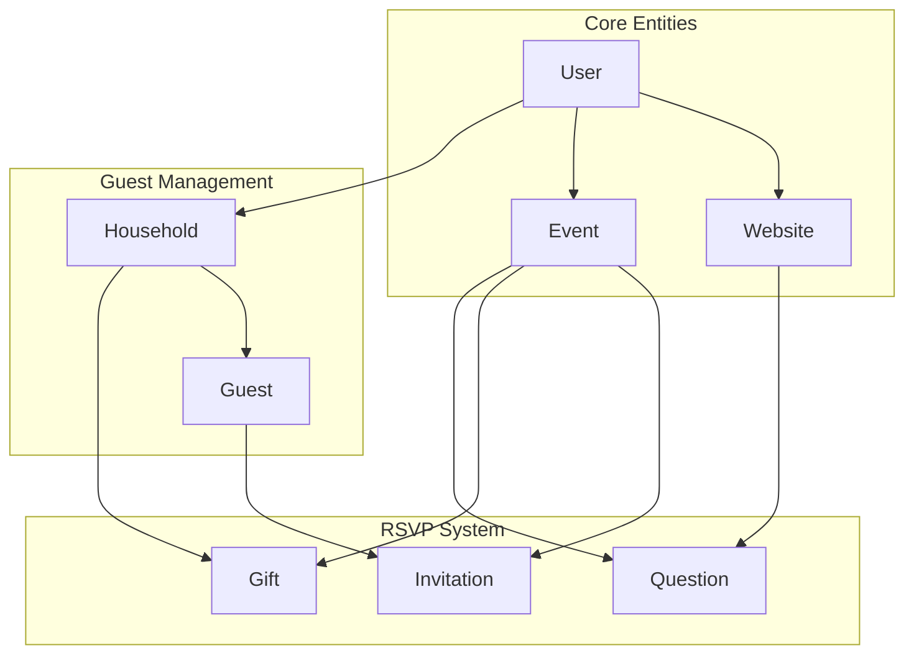
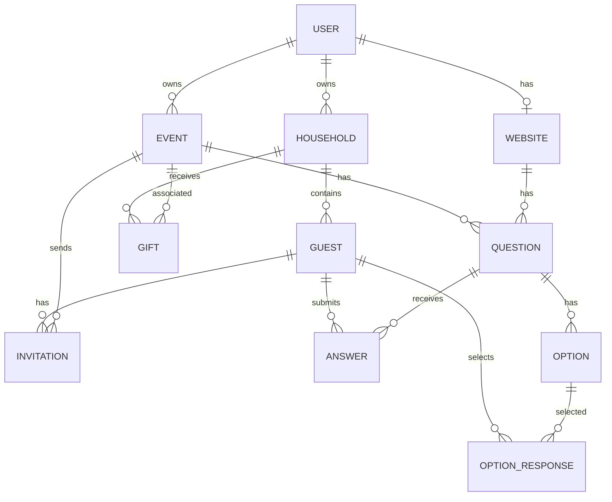

# Domain Layer Documentation

## Overview

The domain layer contains all business entities and their operations. Each domain is self-contained and follows a consistent structure.

---

## Domain List

| Domain | Description | Documentation |
|--------|-------------|---------------|
| [User](./user.md) | User/couple account management | Managed by Better Auth |
| [Website](./website.md) | Wedding website configuration | URL, password, RSVP settings |
| [Event](./event.md) | Wedding events/ceremonies | Ceremony, reception, etc. |
| [Guest](./guest.md) | Individual guest management | Names, contact info |
| [Household](./household.md) | Guest groups/addresses | Family groupings |
| [Invitation](./invitation.md) | Event invitations & RSVPs | RSVP tracking |
| [Question](./question.md) | RSVP questions & responses | Event and website questions |
| [Gift](./gift.md) | Gift tracking per household | Thank you status |

---

## Domain Architecture



---

## Entity Relationships



---

## Standard Domain Structure

Every domain follows this consistent pattern:

```
src/server/domains/{domain}/
├── {domain}.types.ts       # TypeScript interfaces
├── {domain}.validator.ts   # Zod validation schemas
├── {domain}.repository.ts  # Database operations
├── {domain}.service.ts     # Business logic
├── {domain}.router.ts      # tRPC procedures
├── __mocks__/              # Test mocks
│   └── {domain}.repository.ts
└── index.ts                # Barrel export
```

### File Responsibilities

| File | Purpose |
|------|---------|
| **types.ts** | Domain-specific TypeScript interfaces and types |
| **validator.ts** | Zod schemas for input validation |
| **repository.ts** | All Prisma database operations |
| **service.ts** | Business logic, authorization, orchestration |
| **router.ts** | tRPC procedure definitions |
| **index.ts** | Barrel export with singleton instances |

---

## Domain Patterns

### Repository Pattern

Repositories handle all database operations:

```typescript
export class EventRepository {
  constructor(private db: PrismaClient) {}

  async findById(id: string) {
    return this.db.event.findUnique({ where: { id } })
  }

  async create(userId: string, data: CreateEventInput) {
    return this.db.event.create({
      data: { ...data, userId }
    })
  }
}
```

### Service Pattern

Services contain business logic and authorization:

```typescript
export class EventService {
  constructor(private eventRepo: EventRepository) {}

  async getById(eventId: string, userId: string) {
    const event = await this.eventRepo.findById(eventId)

    if (!event || event.userId !== userId) {
      throw new TRPCError({
        code: 'NOT_FOUND',
        message: 'Event not found'
      })
    }

    return event
  }
}
```

### Router Pattern

Routers are thin wrappers around services:

```typescript
export const eventRouter = createTRPCRouter({
  getById: protectedProcedure
    .input(z.object({ id: z.string() }))
    .query(({ ctx, input }) =>
      eventService.getById(input.id, ctx.auth.userId)
    ),
})
```

---

## Cross-Domain References

Domains may reference other domains for read operations, but should never modify other domain's data directly.

### Allowed
```typescript
// Event service reading invitations for stats
class EventService {
  async getWithStats(eventId: string, userId: string) {
    const event = await this.eventRepo.findWithInvitations(eventId)
    // Read-only reference to invitations
    return event
  }
}
```

### Not Allowed
```typescript
// Event service should NOT create invitations
class EventService {
  async create(data: CreateEventInput) {
    const event = await this.eventRepo.create(data)
    // DON'T DO THIS - use Application Service instead
    await this.invitationRepo.createForEvent(event.id)
    return event
  }
}
```

---

## Testing Domains

Each domain includes a `__mocks__` folder with repository mocks:

```typescript
// __mocks__/event.repository.ts
export const mockEventRepository = {
  findById: jest.fn(),
  findByUserId: jest.fn(),
  create: jest.fn(),
  update: jest.fn(),
  delete: jest.fn(),
}
```

Usage in tests:

```typescript
import { mockEventRepository } from '../__mocks__/event.repository'
import { EventService } from '../event.service'

describe('EventService', () => {
  const service = new EventService(mockEventRepository)

  it('should get event by id', async () => {
    mockEventRepository.findById.mockResolvedValue(mockEvent)
    const result = await service.getById('event-id', 'user-id')
    expect(result).toEqual(mockEvent)
  })
})
```
