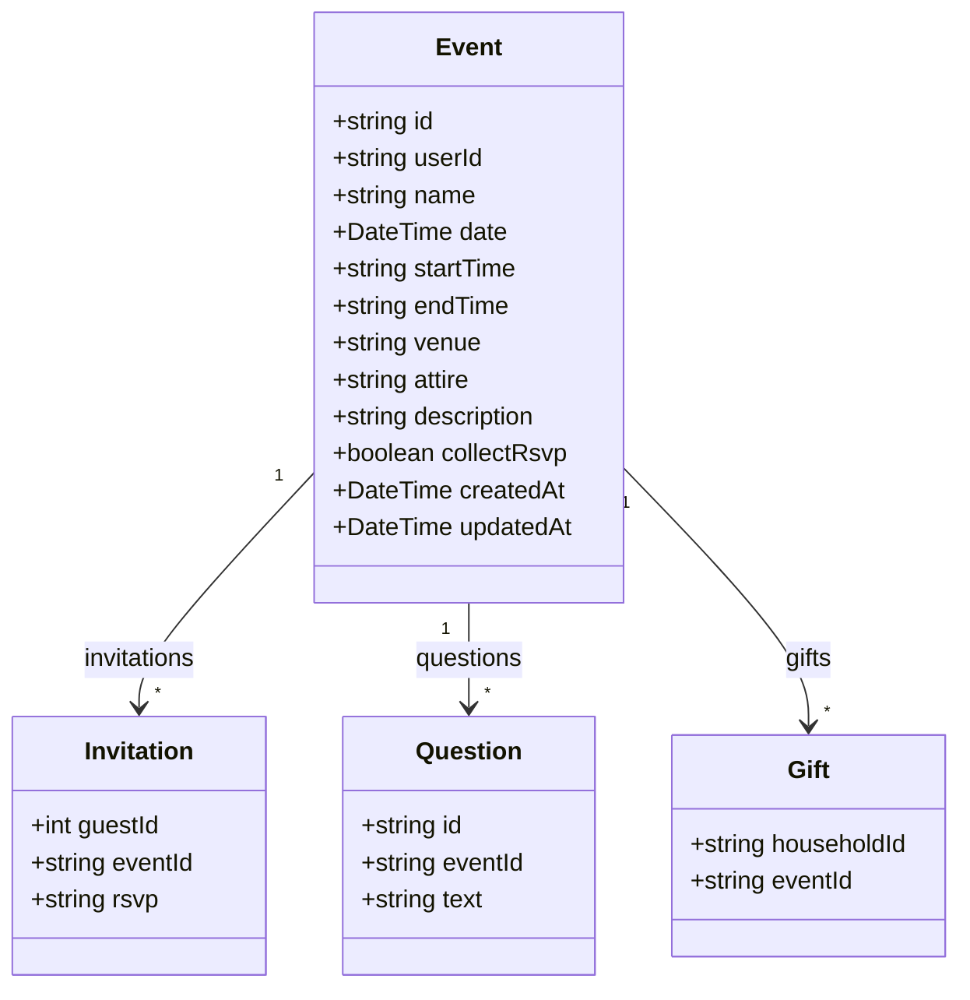
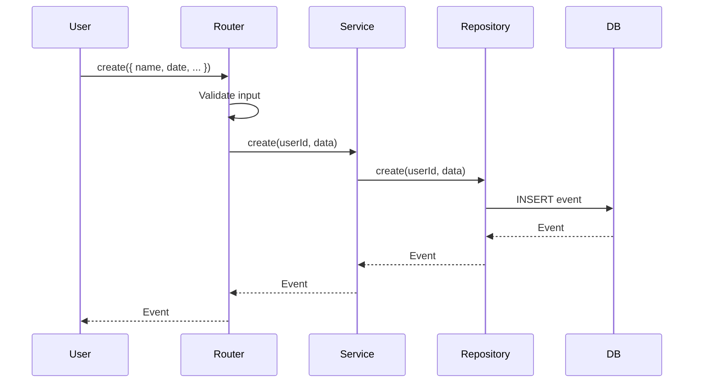
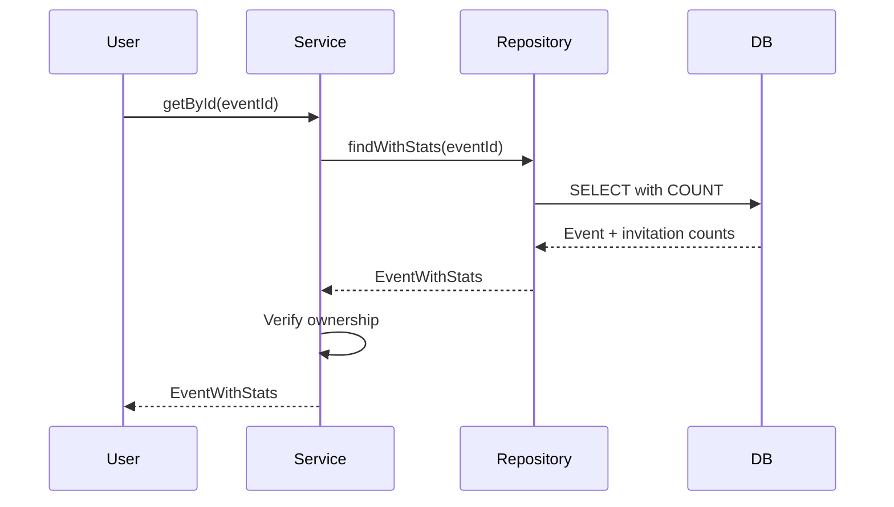

# Event Domain

## Overview

The Event domain manages wedding events such as ceremonies, receptions, rehearsal dinners, and other wedding-related gatherings. Each event can have its own RSVP settings and questions.

---

## Entity Definition



---

## Database Schema

```prisma
model Event {
  id          String       @id @default(uuid())
  name        String
  date        DateTime?    @db.Date
  startTime   String?
  endTime     String?
  venue       String?
  attire      String?
  description String?
  userId      String
  collectRsvp Boolean      @default(false)
  createdAt   DateTime     @default(now())
  updatedAt   DateTime     @updatedAt
  invitations Invitation[]
  gifts       Gift[]
  questions   Question[]
}
```

---

## Operations

| Operation | Procedure | Description |
|-----------|-----------|-------------|
| Get by ID | `event.getById` | Get single event with relations |
| Get User Events | `event.getByUserId` | Get all events for user |
| Get Event Questions | `event.getEventQuestions` | Get questions for an event |
| Create | `event.create` | Create new event |
| Update | `event.update` | Update event details |
| Delete | `event.delete` | Delete event |

---

## Types

```typescript
export type Event = {
  id: string
  userId: string
  name: string
  date: Date | null
  startTime: string | null
  endTime: string | null
  venue: string | null
  attire: string | null
  description: string | null
  collectRsvp: boolean
  createdAt: Date
  updatedAt: Date
}

export type EventWithStats = Event & {
  invitations: Invitation[]
  _count: {
    invitations: number
  }
}

export type EventWithQuestions = Event & {
  questions: Question[]
}

export type CreateEventInput = {
  name: string
  date?: Date
  startTime?: string
  endTime?: string
  venue?: string
  attire?: string
  description?: string
  collectRsvp?: boolean
}

export type UpdateEventInput = CreateEventInput & {
  id: string
}
```

---

## Business Rules

1. **User ownership** - Users can only access their own events
2. **Cascade delete** - Deleting an event cascades to invitations, gifts, and questions
3. **RSVP collection** - Events can optionally collect RSVPs via `collectRsvp` flag
4. **Date validation** - Event dates should be validated for past dates if needed

---

## Data Flow

### Event Creation



### Event with Stats



---

## API Reference

### event.getByUserId

Get all events for the current user.

**Type:** Query (Protected)

**Response:**
```typescript
Event[]
```

### event.getById

Get a single event by ID with invitation statistics.

**Type:** Query (Protected)

**Input:**
```typescript
{ id: string }
```

**Response:**
```typescript
EventWithStats
```

### event.create

Create a new event.

**Type:** Mutation (Protected)

**Input:**
```typescript
{
  name: string
  date?: string // ISO date
  startTime?: string
  endTime?: string
  venue?: string
  attire?: string
  description?: string
  collectRsvp?: boolean
}
```

### event.update

Update an existing event.

**Type:** Mutation (Protected)

**Input:**
```typescript
{
  id: string
  name: string
  date?: string
  startTime?: string
  endTime?: string
  venue?: string
  attire?: string
  description?: string
  collectRsvp?: boolean
}
```

### event.delete

Delete an event and all related data.

**Type:** Mutation (Protected)

**Input:**
```typescript
{ id: string }
```

---

## RSVP Statistics

Events track RSVP statistics through invitations:

| Status | Description |
|--------|-------------|
| `Not Invited` | Guest not yet invited |
| `Invited` | Invitation sent, no response |
| `Attending` | Guest confirmed attendance |
| `Declined` | Guest declined invitation |

---

## Usage Examples

### Create Event

```typescript
const event = await trpc.event.create.mutate({
  name: 'Wedding Ceremony',
  date: '2024-06-15',
  startTime: '2:00 PM',
  endTime: '3:00 PM',
  venue: 'St. Mary\'s Church',
  attire: 'Formal',
  collectRsvp: true
})
```

### Get Events with Stats

```typescript
const events = await trpc.event.getByUserId.query()

events.forEach(event => {
  console.log(`${event.name}: ${event._count.invitations} guests`)
})
```

### Update Event

```typescript
await trpc.event.update.mutate({
  id: 'event-id',
  name: 'Wedding Ceremony & Reception',
  venue: 'The Grand Ballroom'
})
```

### Delete Event

```typescript
await trpc.event.delete.mutate({ id: 'event-id' })
```
