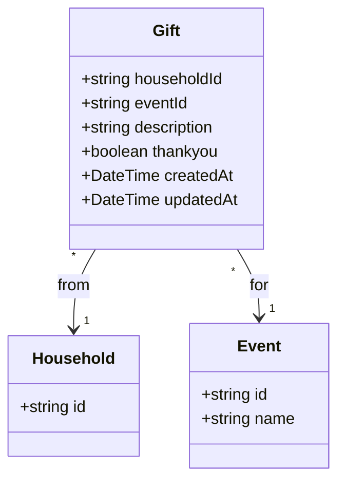
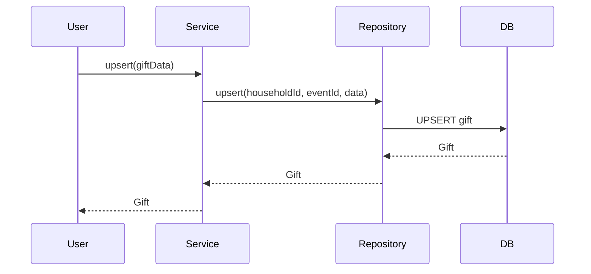
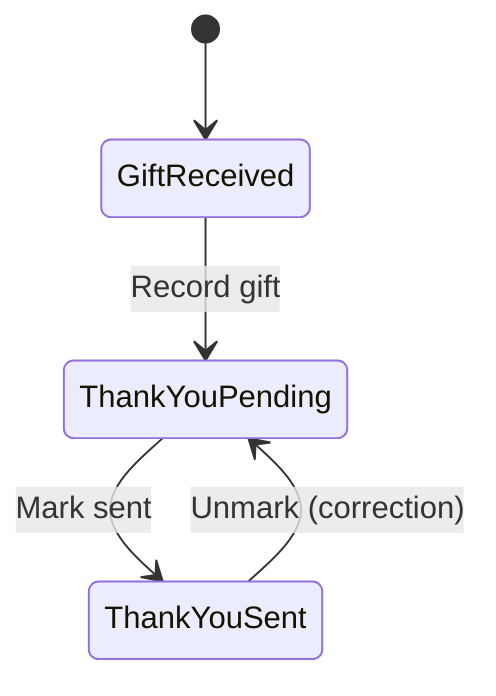
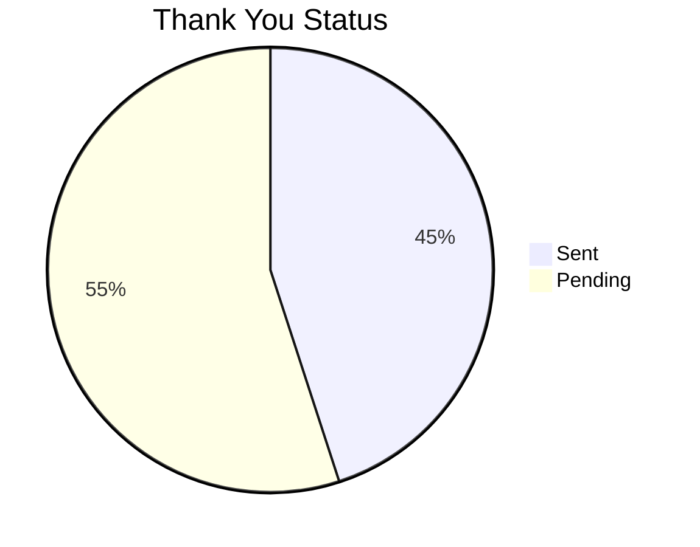

# Gift Domain

## Overview

The Gift domain tracks gifts received from households for specific events. It includes thank-you note tracking to help couples manage their gratitude tasks.

---

## Entity Definition



---

## Database Schema

```prisma
model Gift {
  householdId String
  household   Household @relation(...)
  eventId     String
  event       Event     @relation(...)
  description String?
  thankyou    Boolean   @default(false)
  createdAt   DateTime  @default(now())
  updatedAt   DateTime  @updatedAt

  @@id([householdId, eventId])
}
```

---

## Operations

| Operation | Procedure | Description |
|-----------|-----------|-------------|
| Get by Household | `gift.getByHouseholdId` | Get all gifts from a household |
| Get by Event | `gift.getByEventId` | Get all gifts for an event |
| Upsert | `gift.upsert` | Create or update gift |
| Mark Thank You | `gift.markThankYou` | Toggle thank you status |

---

## Types

```typescript
export type Gift = {
  householdId: string
  eventId: string
  description: string | null
  thankyou: boolean
  createdAt: Date
  updatedAt: Date
}

export type CreateGiftInput = {
  householdId: string
  eventId: string
  description?: string
}

export type UpdateGiftInput = {
  householdId: string
  eventId: string
  description?: string
  thankyou?: boolean
}

export type UpsertGiftInput = {
  householdId: string
  eventId: string
  description?: string
  thankyou?: boolean
}
```

---

## Business Rules

1. **Unique constraint** - One gift record per household-event combination
2. **Thank you tracking** - Boolean flag for thank you note status
3. **Auto-creation** - Gift records created when households are added
4. **Cascade delete** - Deleted when household or event is deleted

---

## Data Flow

### Gift Tracking



### Thank You Workflow



---

## API Reference

### gift.getByHouseholdId

Get all gifts from a specific household.

**Type:** Query (Protected)

**Input:**
```typescript
{ householdId: string }
```

**Response:**
```typescript
Gift[]
```

### gift.getByEventId

Get all gifts for a specific event.

**Type:** Query (Protected)

**Input:**
```typescript
{ eventId: string }
```

**Response:**
```typescript
(Gift & { household: HouseholdWithGuests })[]
```

### gift.upsert

Create or update a gift record.

**Type:** Mutation (Protected)

**Input:**
```typescript
{
  householdId: string
  eventId: string
  description?: string
  thankyou?: boolean
}
```

### gift.markThankYou

Toggle the thank you status for a gift.

**Type:** Mutation (Protected)

**Input:**
```typescript
{
  householdId: string
  eventId: string
  thankyou: boolean
}
```

---

## Thank You Tracking Dashboard

The gift domain enables tracking thank you notes:



---

## Usage Examples

### Record Gift

```typescript
await trpc.gift.upsert.mutate({
  householdId: 'household-id',
  eventId: 'event-id',
  description: 'KitchenAid Mixer - Silver'
})
```

### Mark Thank You Sent

```typescript
await trpc.gift.markThankYou.mutate({
  householdId: 'household-id',
  eventId: 'event-id',
  thankyou: true
})
```

### Get Gifts Pending Thank You

```typescript
const gifts = await trpc.gift.getByEventId.query({
  eventId: 'event-id'
})

const pendingThankYou = gifts.filter(g => !g.thankyou)
console.log(`${pendingThankYou.length} thank you notes to send`)
```

### Display Gift with Household

```typescript
const gifts = await trpc.gift.getByEventId.query({
  eventId: 'event-id'
})

gifts.forEach(gift => {
  const primaryGuest = gift.household.guests.find(g => g.isPrimaryContact)
  console.log(`From: ${primaryGuest?.firstName} ${primaryGuest?.lastName}`)
  console.log(`Gift: ${gift.description || 'Not recorded'}`)
  console.log(`Thank you: ${gift.thankyou ? 'Sent' : 'Pending'}`)
})
```

---

## Related Domains

- **[Household](./household.md)** - Gift giver
- **[Event](./event.md)** - Associated event

---

## Application Service

Gift records are automatically created when households are added through the [Household Management Service](../application-services/household-management.md).
