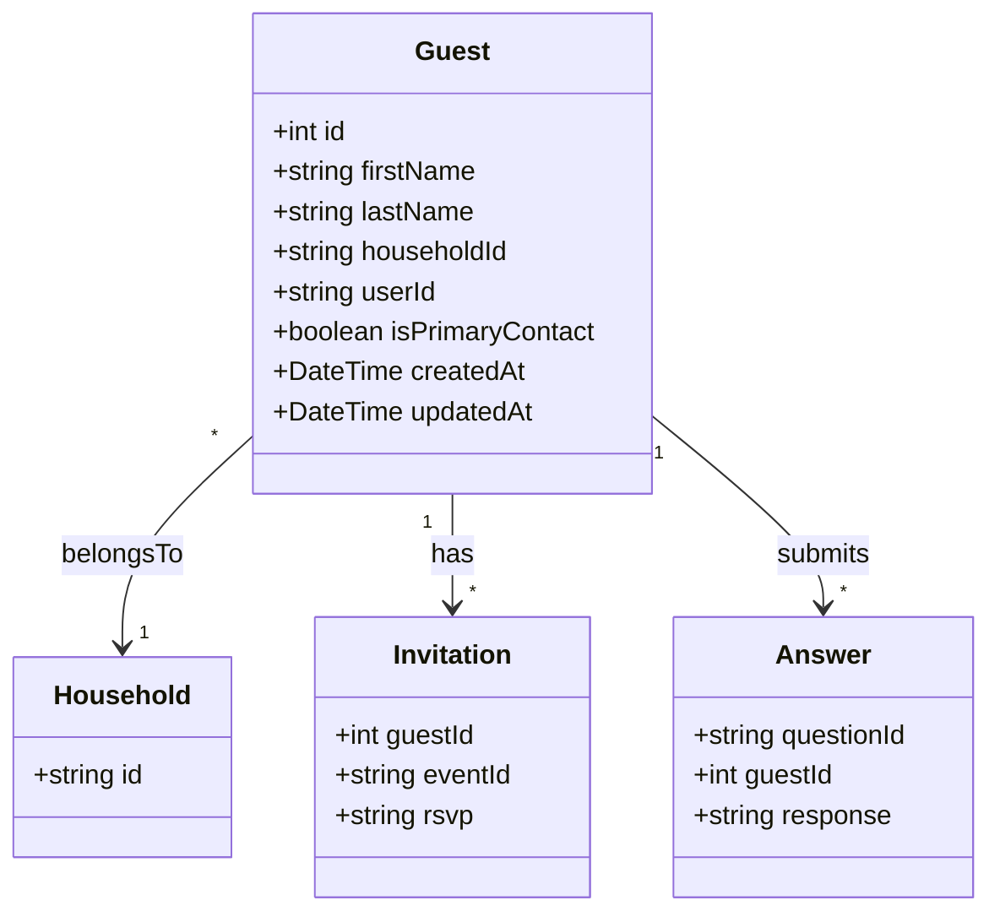
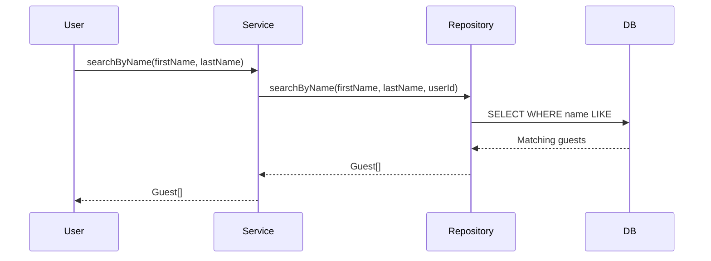
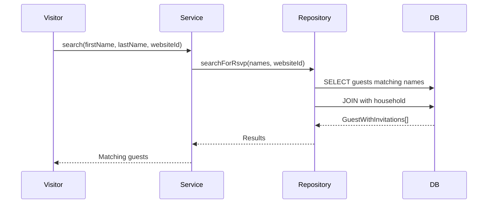
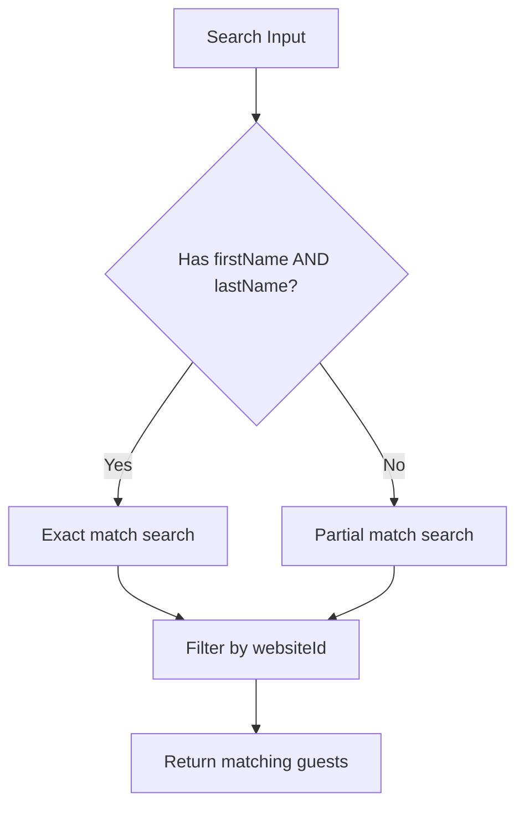

# Guest Domain

## Overview

The Guest domain manages individual wedding guests. Each guest belongs to a household and can have invitations to multiple events.

---

## Entity Definition



---

## Database Schema

```prisma
model Guest {
  id               Int              @id @default(autoincrement())
  firstName        String
  lastName         String
  householdId      String
  userId           String
  isPrimaryContact Boolean
  createdAt        DateTime         @default(now())
  updatedAt        DateTime         @updatedAt
  household        Household        @relation(...)
  invitations      Invitation[]
  optionResponses  OptionResponse[]
  answers          Answer[]
}
```

---

## Operations

| Operation | Procedure | Description |
|-----------|-----------|-------------|
| Get by ID | `guest.getById` | Get guest with invitations |
| Search | `guest.search` | Search guests by name |
| Search by Name | `guest.searchByName` | Find guests by first/last name |
| Create | `guest.create` | Create single guest |
| Create Many | `guest.createMany` | Create multiple guests |
| Update | `guest.update` | Update guest details |
| Delete | `guest.delete` | Delete guest |

---

## Types

```typescript
export type Guest = {
  id: number
  firstName: string
  lastName: string
  householdId: string
  userId: string
  isPrimaryContact: boolean
  createdAt: Date
  updatedAt: Date
}

export type GuestWithInvitations = Guest & {
  invitations: Invitation[]
  household: Household
}

export type CreateGuestInput = {
  firstName: string
  lastName: string
  householdId: string
  isPrimaryContact?: boolean
}

export type UpdateGuestInput = {
  id: number
  firstName?: string
  lastName?: string
  isPrimaryContact?: boolean
}
```

---

## Business Rules

1. **Household membership** - Every guest must belong to a household
2. **Primary contact** - Each household should have one primary contact
3. **User ownership** - Users can only access guests they created
4. **Cascade delete** - Deleting a guest cascades to invitations and answers

---

## Data Flow

### Guest Search Flow



### RSVP Guest Lookup



---

## API Reference

### guest.search

Search for guests by name (for RSVP lookup).

**Type:** Query (Public)

**Input:**
```typescript
{
  firstName: string
  lastName: string
  websiteId: string
}
```

**Response:**
```typescript
GuestWithInvitations[]
```

### guest.searchByName

Search guests by name (dashboard).

**Type:** Query (Protected)

**Input:**
```typescript
{
  firstName?: string
  lastName?: string
}
```

### guest.getById

Get a single guest with all invitations.

**Type:** Query (Protected)

**Input:**
```typescript
{ id: number }
```

### guest.create

Create a new guest.

**Type:** Mutation (Protected)

**Input:**
```typescript
{
  firstName: string
  lastName: string
  householdId: string
  isPrimaryContact?: boolean
}
```

### guest.update

Update guest information.

**Type:** Mutation (Protected)

**Input:**
```typescript
{
  id: number
  firstName?: string
  lastName?: string
  isPrimaryContact?: boolean
}
```

### guest.delete

Delete a guest.

**Type:** Mutation (Protected)

**Input:**
```typescript
{ id: number }
```

---

## Guest Search Algorithm

The guest search supports RSVP lookups with flexible name matching:



---

## Usage Examples

### Search for Guest (RSVP)

```typescript
const guests = await trpc.guest.search.query({
  firstName: 'John',
  lastName: 'Smith',
  websiteId: 'website-id'
})
```

### Create Guest

```typescript
const guest = await trpc.guest.create.mutate({
  firstName: 'Jane',
  lastName: 'Doe',
  householdId: 'household-id',
  isPrimaryContact: true
})
```

### Update Guest

```typescript
await trpc.guest.update.mutate({
  id: 1,
  firstName: 'Janet',
  isPrimaryContact: false
})
```

---

## Related Domains

- **[Household](./household.md)** - Guest grouping
- **[Invitation](./invitation.md)** - Event invitations
- **[Question](./question.md)** - Guest responses
