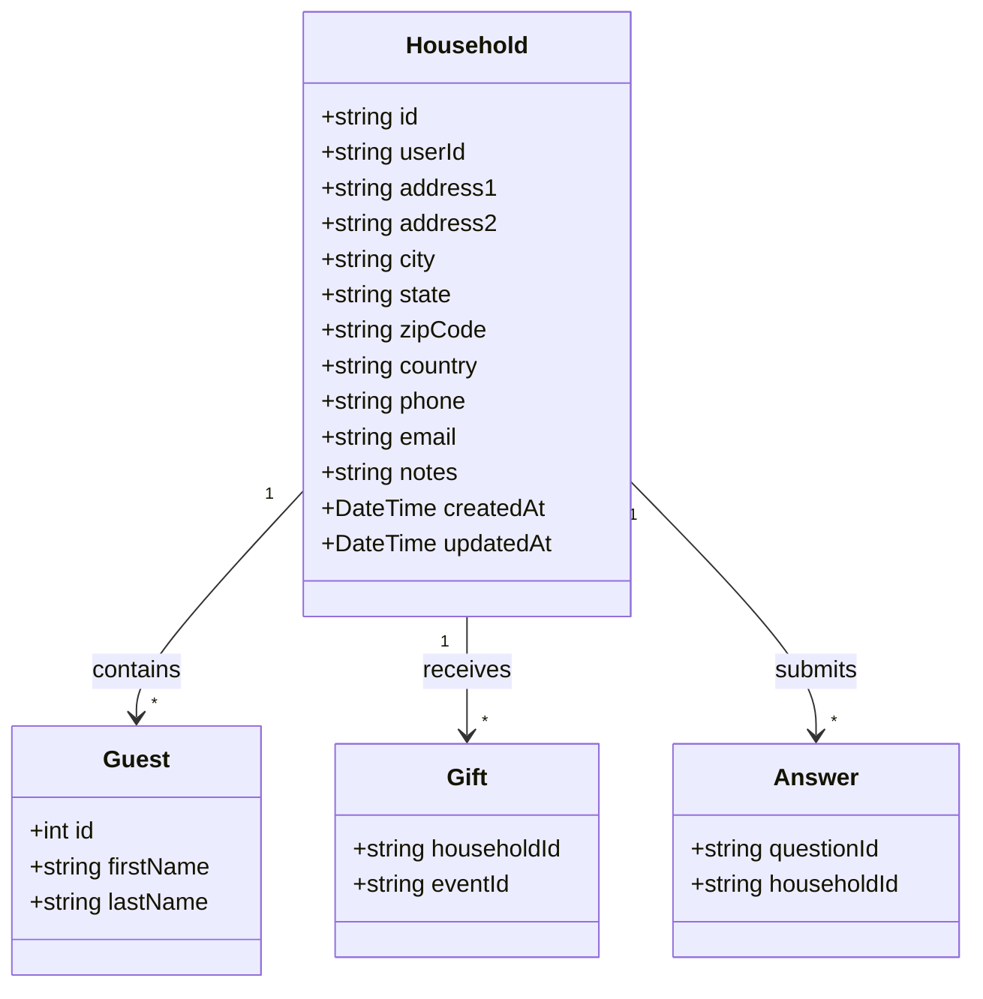
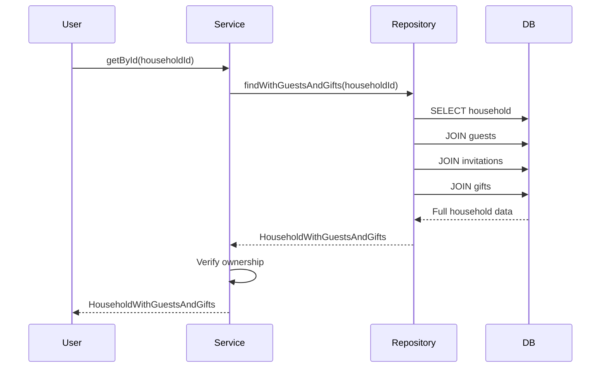

# Household Domain

## Overview

The Household domain manages guest groupings, typically representing families or groups living at the same address. Households contain guests, receive gifts, and store contact information.

---

## Entity Definition



---

## Database Schema

```prisma
model Household {
  id             String           @id @default(uuid())
  userId         String
  createdAt      DateTime         @default(now())
  updatedAt      DateTime         @updatedAt
  address1       String?
  address2       String?
  city           String?
  state          String?
  zipCode        String?
  country        String?
  phone          String?
  email          String?
  notes          String?
  gifts          Gift[]
  guests         Guest[]
  answers        Answer[]
  optionReponses OptionResponse[]
}
```

---

## Operations

| Operation | Procedure | Description |
|-----------|-----------|-------------|
| Get by ID | `household.getById` | Get household with guests and gifts |
| Get by User | `household.getByUserId` | Get all user's households |
| Search | `household.search` | Search households |
| Create | `household.create` | Create empty household |
| Update | `household.update` | Update household details |
| Delete | `household.delete` | Delete household and guests |

---

## Types

```typescript
export type Household = {
  id: string
  userId: string
  address1: string | null
  address2: string | null
  city: string | null
  state: string | null
  zipCode: string | null
  country: string | null
  phone: string | null
  email: string | null
  notes: string | null
  createdAt: Date
  updatedAt: Date
}

export type HouseholdWithGuests = Household & {
  guests: Guest[]
}

export type HouseholdWithGuestsAndGifts = Household & {
  guests: GuestWithInvitations[]
  gifts: Gift[]
}

export type CreateHouseholdInput = {
  address1?: string
  address2?: string
  city?: string
  state?: string
  zipCode?: string
  country?: string
  phone?: string
  email?: string
  notes?: string
}

export type SearchHouseholdInput = {
  query?: string
  page?: number
  limit?: number
}
```

---

## Business Rules

1. **User ownership** - Households belong to a single user
2. **Cascade delete** - Deleting a household cascades to all guests
3. **Contact info** - At least one contact method recommended (email or phone)
4. **Primary contact** - Each household should designate a primary contact guest

---

## Data Flow

### Household with Full Data



---

## API Reference

### household.getByUserId

Get all households for the current user.

**Type:** Query (Protected)

**Response:**
```typescript
HouseholdWithGuests[]
```

### household.getById

Get a single household with guests and gifts.

**Type:** Query (Protected)

**Input:**
```typescript
{ id: string }
```

**Response:**
```typescript
HouseholdWithGuestsAndGifts
```

### household.search

Search households by name or address.

**Type:** Query (Protected)

**Input:**
```typescript
{
  query?: string
  page?: number
  limit?: number
}
```

### household.create

Create a new household.

**Type:** Mutation (Protected)

**Input:**
```typescript
{
  address1?: string
  city?: string
  state?: string
  zipCode?: string
  phone?: string
  email?: string
  notes?: string
}
```

### household.update

Update household details.

**Type:** Mutation (Protected)

**Input:**
```typescript
{
  id: string
  address1?: string
  city?: string
  state?: string
  zipCode?: string
  phone?: string
  email?: string
  notes?: string
}
```

### household.delete

Delete a household and all its guests.

**Type:** Mutation (Protected)

**Input:**
```typescript
{ id: string }
```

---

## Household Display Name

Households are typically displayed using the primary contact's name or combined guest names:

```typescript
function getHouseholdDisplayName(household: HouseholdWithGuests): string {
  const primaryContact = household.guests.find(g => g.isPrimaryContact)
  if (primaryContact) {
    return `${primaryContact.firstName} ${primaryContact.lastName}`
  }

  // Fall back to first guest or "Unknown"
  const firstGuest = household.guests[0]
  return firstGuest
    ? `${firstGuest.lastName} Household`
    : 'Unknown Household'
}
```

---

## Usage Examples

### Create Household

```typescript
const household = await trpc.household.create.mutate({
  address1: '123 Main St',
  city: 'New York',
  state: 'NY',
  zipCode: '10001',
  email: 'smith@email.com',
  phone: '555-1234'
})
```

### Get Household with Details

```typescript
const household = await trpc.household.getById.query({
  id: 'household-id'
})

console.log(`Guests: ${household.guests.length}`)
console.log(`Gifts: ${household.gifts.length}`)
```

### Search Households

```typescript
const results = await trpc.household.search.query({
  query: 'Smith',
  page: 1,
  limit: 20
})
```

---

## Related Domains

- **[Guest](./guest.md)** - Individual guests in household
- **[Gift](./gift.md)** - Gifts received by household
- **[Question](./question.md)** - Household-level responses

---

## Application Service

For complex household operations (creating with guests, updating with invitations), use the [Household Management Service](../application-services/household-management.md).
