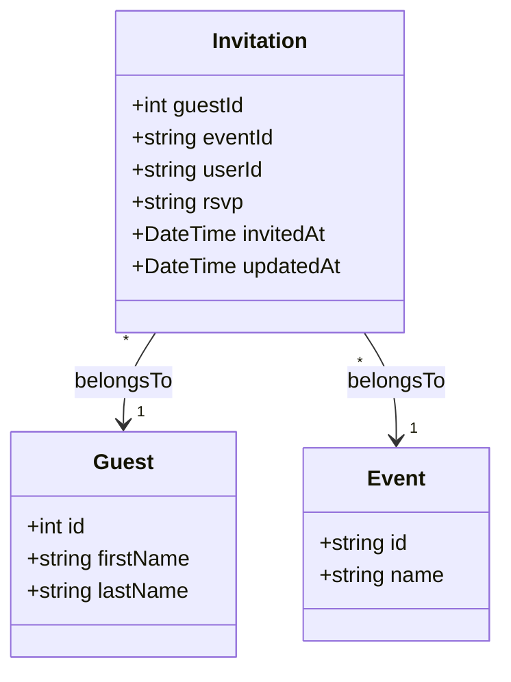
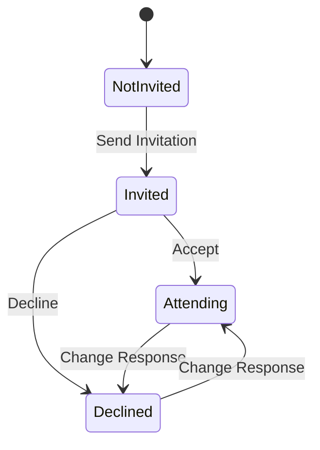
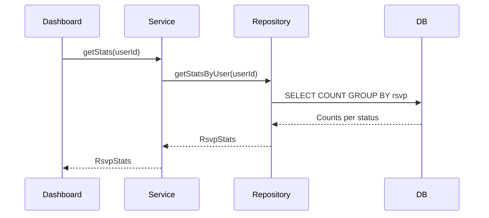
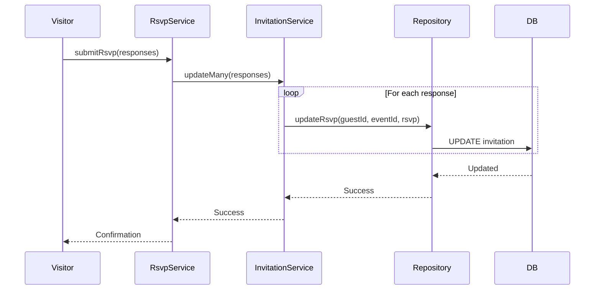
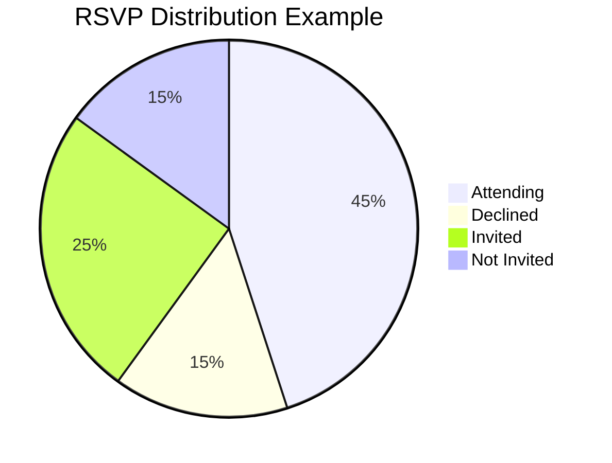

# Invitation Domain

## Overview

The Invitation domain manages event invitations and RSVP responses. Each invitation links a guest to an event with an RSVP status.

---

## Entity Definition



---

## Database Schema

```prisma
model Invitation {
  guest     Guest    @relation(...)
  guestId   Int
  event     Event    @relation(...)
  eventId   String
  invitedAt DateTime @default(now())
  updatedAt DateTime @updatedAt
  rsvp      String?  @default("Not Invited")
  userId    String

  @@id([guestId, eventId])
}
```

---

## RSVP Statuses

| Status | Description | Visual |
|--------|-------------|--------|
| `Not Invited` | Guest not yet invited to event | Gray |
| `Invited` | Invitation sent, awaiting response | Yellow |
| `Attending` | Guest confirmed attendance | Green |
| `Declined` | Guest declined invitation | Red |



---

## Operations

| Operation | Procedure | Description |
|-----------|-----------|-------------|
| Get Stats | `invitation.getStats` | Get RSVP statistics |
| Update RSVP | `invitation.updateRsvp` | Update single RSVP status |
| Update Many | `invitation.updateMany` | Bulk update RSVPs |
| Create for Guest | `invitation.createForGuest` | Create invitations for new guest |

---

## Types

```typescript
export type Invitation = {
  guestId: number
  eventId: string
  userId: string
  rsvp: string | null
  invitedAt: Date
  updatedAt: Date
}

export type RsvpStats = {
  total: number
  notInvited: number
  invited: number
  attending: number
  declined: number
}

export type CreateInvitationInput = {
  guestId: number
  eventId: string
  rsvp?: string
}

export type UpdateInvitationInput = {
  guestId: number
  eventId: string
  rsvp: string
}
```

---

## Business Rules

1. **Unique constraint** - One invitation per guest-event combination
2. **User ownership** - Users can only manage their own invitations
3. **Valid statuses** - RSVP must be one of the defined statuses
4. **Auto-creation** - Invitations created automatically when guests are added

---

## Data Flow

### RSVP Statistics



### Bulk RSVP Update (Guest RSVP Flow)



---

## API Reference

### invitation.getStats

Get RSVP statistics for all user's events.

**Type:** Query (Protected)

**Response:**
```typescript
{
  overall: RsvpStats
  byEvent: {
    eventId: string
    eventName: string
    stats: RsvpStats
  }[]
}
```

### invitation.updateRsvp

Update a single invitation's RSVP status.

**Type:** Mutation (Protected)

**Input:**
```typescript
{
  guestId: number
  eventId: string
  rsvp: 'Not Invited' | 'Invited' | 'Attending' | 'Declined'
}
```

### invitation.updateMany

Bulk update multiple invitations.

**Type:** Mutation (Protected)

**Input:**
```typescript
{
  invitations: {
    guestId: number
    eventId: string
    rsvp: string
  }[]
}
```

### invitation.createForGuest

Create invitations for a new guest across all events.

**Type:** Mutation (Protected)

**Input:**
```typescript
{
  guestId: number
  eventIds: string[]
}
```

---

## Statistics Calculation



---

## Usage Examples

### Get Statistics

```typescript
const stats = await trpc.invitation.getStats.query()

console.log(`Total guests: ${stats.overall.total}`)
console.log(`Attending: ${stats.overall.attending}`)
console.log(`Response rate: ${
  ((stats.overall.attending + stats.overall.declined) /
   stats.overall.invited * 100).toFixed(1)
}%`)
```

### Update Single RSVP

```typescript
await trpc.invitation.updateRsvp.mutate({
  guestId: 1,
  eventId: 'event-id',
  rsvp: 'Attending'
})
```

### Bulk Update (Admin)

```typescript
await trpc.invitation.updateMany.mutate({
  invitations: [
    { guestId: 1, eventId: 'event-1', rsvp: 'Attending' },
    { guestId: 1, eventId: 'event-2', rsvp: 'Attending' },
    { guestId: 2, eventId: 'event-1', rsvp: 'Declined' },
  ]
})
```

---

## Related Domains

- **[Guest](./guest.md)** - Guest being invited
- **[Event](./event.md)** - Event to invite to

---

## Application Service

For complete RSVP submission workflow, see [RSVP Submission Service](../application-services/rsvp-submission.md).
