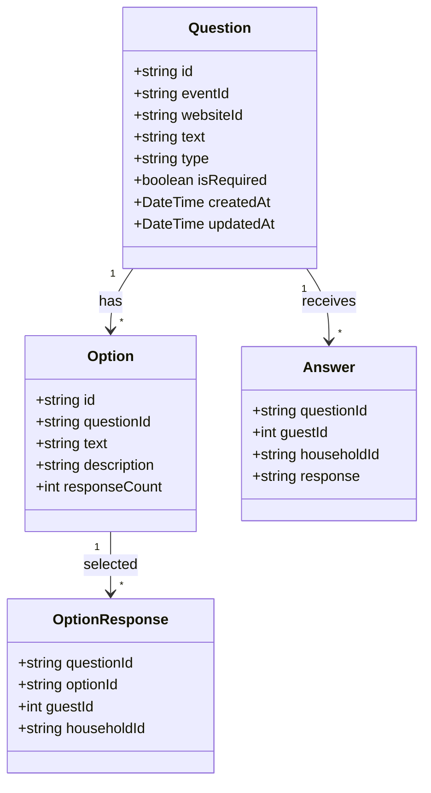
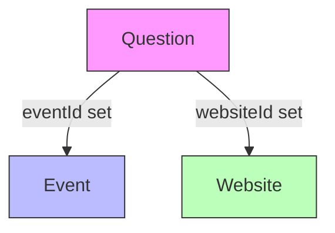
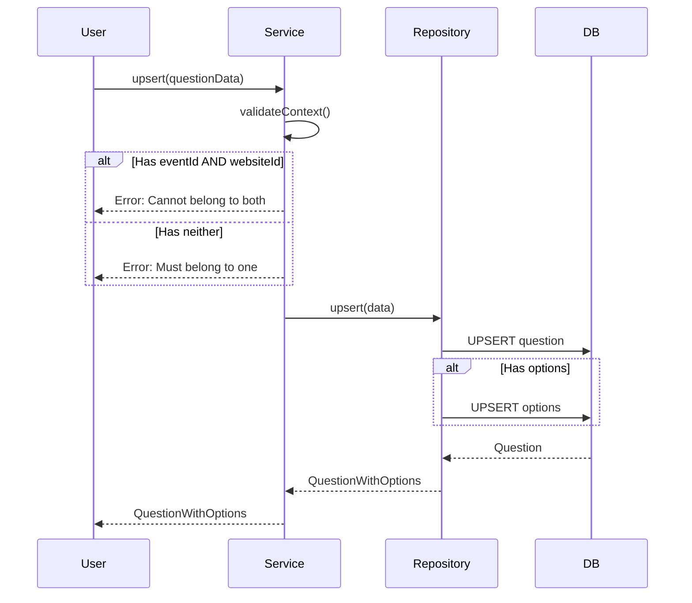
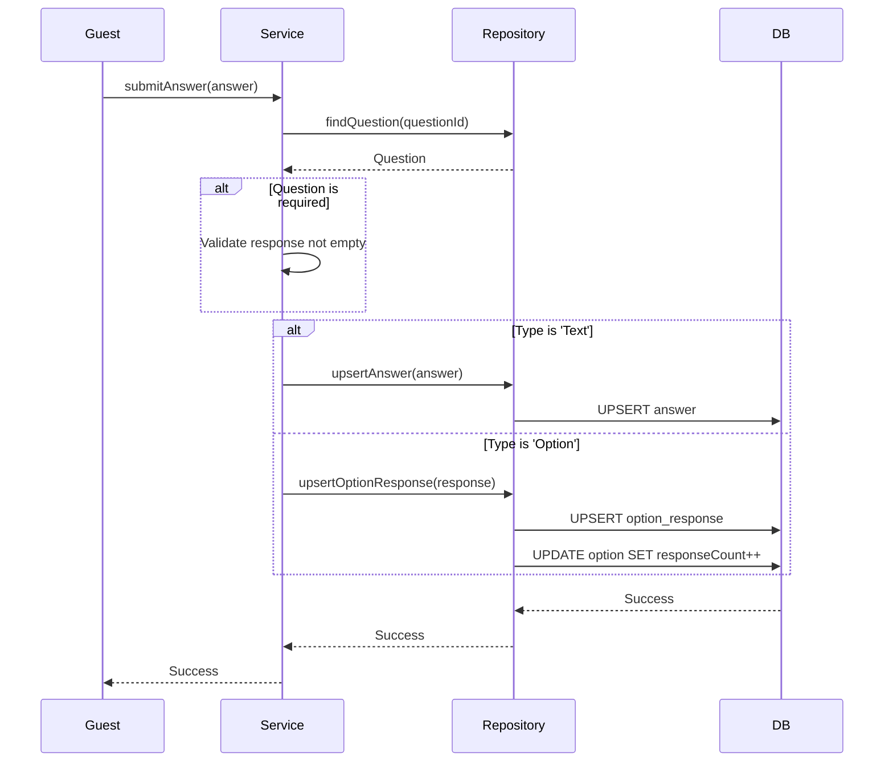
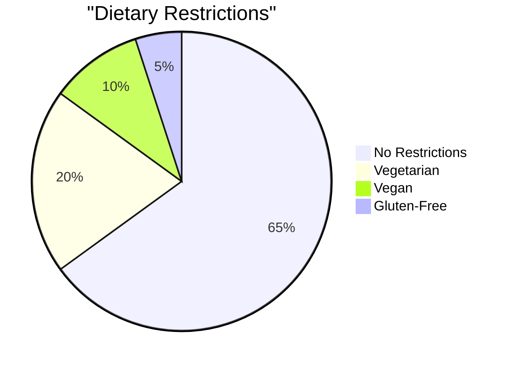

# Question Domain

## Overview

The Question domain manages RSVP questions and collects responses. Questions can be attached to either Events (event-specific questions) or Websites (general questions). This unified domain handles both text responses and multiple-choice options.

---

## Entity Definitions



---

## Database Schema

```prisma
model Question {
  id         String   @id @default(uuid())
  eventId    String?
  event      Event?   @relation(...)
  websiteId  String?
  website    Website? @relation(...)
  text       String
  type       String   // 'Text' | 'Option'
  isRequired Boolean  @default(false)
  options    Option[]
  answers    Answer[]
}

model Option {
  id              String           @id @default(uuid())
  responseCount   Int              @default(0)
  text            String
  description     String
  questionId      String
  question        Question         @relation(...)
  optionResponses OptionResponse[]
}

model Answer {
  response    String
  questionId  String
  guestId     Int
  householdId String

  @@id([questionId, guestId, householdId])
}

model OptionResponse {
  questionId  String
  optionId    String
  guestId     Int
  householdId String

  @@id([questionId, guestId, householdId])
}
```

---

## Question Types

| Type | Description | Response Format |
|------|-------------|-----------------|
| `Text` | Free-text response | `Answer` record |
| `Option` | Multiple choice | `OptionResponse` record |

---

## Question Context

Questions must belong to exactly one context:



**Rules:**
- Question must have `eventId` OR `websiteId` (not both, not neither)
- Event questions appear during event-specific RSVP
- Website questions appear for all guests (general questions)

---

## Operations

| Operation | Procedure | Description |
|-----------|-----------|-------------|
| Get by Event | `question.getByEventId` | Get event questions |
| Get by Website | `question.getByWebsiteId` | Get website questions |
| Get with Responses | `question.getWithResponses` | Get question with all answers |
| Upsert | `question.upsert` | Create or update question |
| Delete | `question.delete` | Delete question |
| Submit Answer | `question.submitAnswer` | Submit text answer |
| Submit Option | `question.submitOptionResponse` | Submit option selection |

---

## Types

```typescript
export type Question = {
  id: string
  eventId: string | null
  websiteId: string | null
  text: string
  type: 'Text' | 'Option'
  isRequired: boolean
  createdAt: Date
  updatedAt: Date
}

export type Option = {
  id: string
  questionId: string
  text: string
  description: string
  responseCount: number
}

export type QuestionWithOptions = Question & {
  options: Option[]
}

export type Answer = {
  questionId: string
  guestId: number
  householdId: string
  response: string
  guestFirstName: string | null
  guestLastName: string | null
}

export type UpsertQuestionInput = {
  id?: string
  eventId?: string
  websiteId?: string
  text: string
  type: 'Text' | 'Option'
  isRequired: boolean
  options?: OptionInput[]
}

export type OptionInput = {
  id?: string
  text: string
  description: string
}
```

---

## Business Rules

1. **Exclusive context** - Question belongs to Event OR Website, not both
2. **Required validation** - Required questions must be answered
3. **Option uniqueness** - Options within a question must be unique
4. **Response tracking** - Option response counts are automatically maintained

---

## Data Flow

### Question Creation



### Answer Submission



---

## API Reference

### question.getByEventId

Get all questions for an event.

**Type:** Query (Protected)

**Input:**
```typescript
{ eventId: string }
```

**Response:**
```typescript
QuestionWithOptions[]
```

### question.getByWebsiteId

Get general questions for a website.

**Type:** Query (Public)

**Input:**
```typescript
{ websiteId: string }
```

### question.upsert

Create or update a question with options.

**Type:** Mutation (Protected)

**Input:**
```typescript
{
  id?: string  // If provided, updates existing
  eventId?: string
  websiteId?: string
  text: string
  type: 'Text' | 'Option'
  isRequired: boolean
  options?: {
    id?: string
    text: string
    description: string
  }[]
}
```

### question.delete

Delete a question.

**Type:** Mutation (Protected)

**Input:**
```typescript
{
  id: string
  eventId?: string  // For ownership verification
  websiteId?: string
}
```

### question.submitAnswer

Submit a text answer.

**Type:** Mutation (Public)

**Input:**
```typescript
{
  questionId: string
  guestId: number
  householdId: string
  response: string
}
```

### question.submitOptionResponse

Submit a multiple choice response.

**Type:** Mutation (Public)

**Input:**
```typescript
{
  questionId: string
  optionId: string
  guestId: number
  householdId: string
}
```

---

## Option Response Tracking

Option response counts enable analytics:



---

## Usage Examples

### Create Event Question

```typescript
const question = await trpc.question.upsert.mutate({
  eventId: 'event-id',
  text: 'Any dietary restrictions?',
  type: 'Option',
  isRequired: true,
  options: [
    { text: 'None', description: '' },
    { text: 'Vegetarian', description: 'No meat' },
    { text: 'Vegan', description: 'No animal products' },
    { text: 'Gluten-Free', description: 'No gluten' },
  ]
})
```

### Create Website Question

```typescript
const question = await trpc.question.upsert.mutate({
  websiteId: 'website-id',
  text: 'Song request for the reception?',
  type: 'Text',
  isRequired: false
})
```

### Get Questions with Responses

```typescript
const questions = await trpc.question.getByEventId.query({
  eventId: 'event-id'
})

questions.forEach(q => {
  if (q.type === 'Option') {
    q.options.forEach(opt => {
      console.log(`${opt.text}: ${opt.responseCount} responses`)
    })
  }
})
```

---

## Related Domains

- **[Event](./event.md)** - Event-specific questions
- **[Website](./website.md)** - General questions
- **[Guest](./guest.md)** - Guest responses
