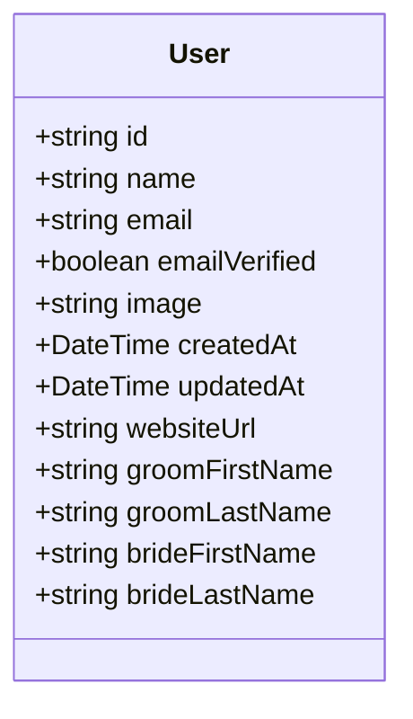

# User Domain

## Overview

The User domain manages couple account information. User authentication is handled by Better Auth, while this domain manages user profile data specific to OSWP.

---

## Entity Definition



---

## Database Schema

```prisma
model User {
  id             String    @id
  name           String?
  email          String    @unique
  emailVerified  Boolean   @default(false)
  image          String?
  createdAt      DateTime  @default(now())
  updatedAt      DateTime  @updatedAt
  websiteUrl     String?
  groomFirstName String?
  groomLastName  String?
  brideFirstName String?
  brideLastName  String?

  sessions       Session[]
  accounts       Account[]
}
```

---

## Operations

| Operation | Procedure | Description |
|-----------|-----------|-------------|
| Get by ID | `user.getById` | Retrieve user profile |
| Update | `user.update` | Update couple names |

---

## Types

```typescript
export type User = {
  id: string
  name: string | null
  email: string
  emailVerified: boolean
  image: string | null
  websiteUrl: string | null
  groomFirstName: string | null
  groomLastName: string | null
  brideFirstName: string | null
  brideLastName: string | null
  createdAt: Date
  updatedAt: Date
}

export type UpdateUserInput = {
  groomFirstName: string
  groomLastName: string
  brideFirstName: string
  brideLastName: string
}
```

---

## Business Rules

1. **Email uniqueness** - Each user must have a unique email address
2. **Better Auth integration** - User creation/authentication is managed by Better Auth
3. **Profile ownership** - Users can only update their own profile

---

## API Reference

### user.getById

Get the current authenticated user's profile.

**Type:** Query (Protected)

**Response:**
```typescript
{
  id: string
  name: string | null
  email: string
  groomFirstName: string | null
  groomLastName: string | null
  brideFirstName: string | null
  brideLastName: string | null
}
```

### user.update

Update the couple's names.

**Type:** Mutation (Protected)

**Input:**
```typescript
{
  groomFirstName: string
  groomLastName: string
  brideFirstName: string
  brideLastName: string
}
```

---

## Dependencies

- **Session** - Authentication sessions (managed by Better Auth)
- **Account** - OAuth accounts (managed by Better Auth)

---

## Usage Examples

### Get Current User

```typescript
const user = await trpc.user.getById.query()
console.log(`Welcome, ${user.groomFirstName} & ${user.brideFirstName}!`)
```

### Update Names

```typescript
await trpc.user.update.mutate({
  groomFirstName: 'John',
  groomLastName: 'Smith',
  brideFirstName: 'Jane',
  brideLastName: 'Doe'
})
```
