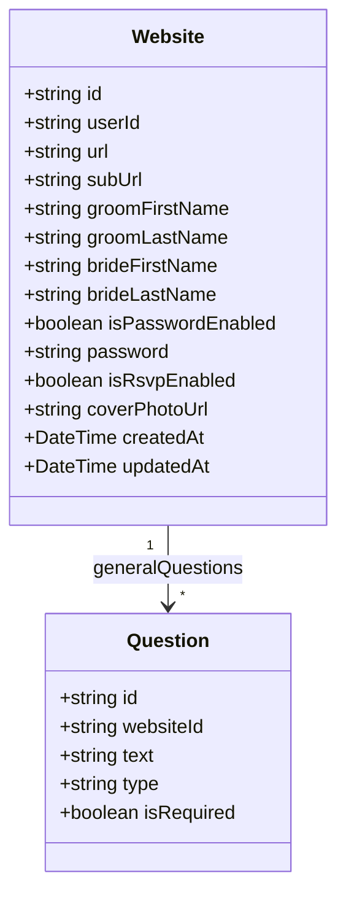
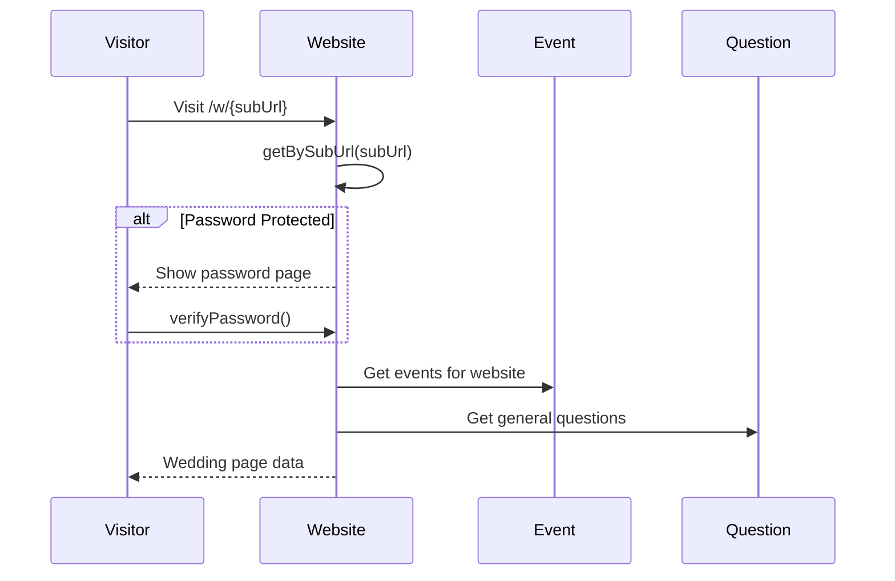

# Website Domain

## Overview

The Website domain manages the couple's public wedding website configuration, including URL settings, password protection, RSVP enablement, and cover photo.

---

## Entity Definition



---

## Database Schema

```prisma
model Website {
  id                String     @id @default(uuid())
  createdAt         DateTime   @default(now())
  updatedAt         DateTime   @updatedAt
  userId            String     @unique
  url               String     @unique
  subUrl            String     @unique
  groomFirstName    String
  groomLastName     String
  brideFirstName    String
  brideLastName     String
  isPasswordEnabled Boolean    @default(false)
  password          String?
  isRsvpEnabled     Boolean    @default(true)
  coverPhotoUrl     String?
  generalQuestions  Question[] @relation(name: "Website_Questions")
}
```

---

## Operations

| Operation | Procedure | Description |
|-----------|-----------|-------------|
| Get by User ID | `website.getByUserId` | Get user's website |
| Get by Sub URL | `website.getBySubUrl` | Get website by custom URL |
| Get Wedding Page | `website.getWeddingPage` | Get full wedding page data |
| Create | `website.create` | Create new website |
| Update | `website.update` | Update website settings |
| Update Cover Photo | `website.updateCoverPhoto` | Update cover photo URL |
| Verify Password | `website.verifyPassword` | Verify website password |

---

## Types

```typescript
export type Website = {
  id: string
  userId: string
  url: string
  subUrl: string
  groomFirstName: string
  groomLastName: string
  brideFirstName: string
  brideLastName: string
  isPasswordEnabled: boolean
  password: string | null
  isRsvpEnabled: boolean
  coverPhotoUrl: string | null
  createdAt: Date
  updatedAt: Date
}

export type WebsiteWithQuestions = Website & {
  generalQuestions: Question[]
}

export type CreateWebsiteInput = {
  url: string
  subUrl: string
  groomFirstName: string
  groomLastName: string
  brideFirstName: string
  brideLastName: string
}

export type UpdateWebsiteInput = {
  url?: string
  subUrl?: string
  groomFirstName?: string
  groomLastName?: string
  brideFirstName?: string
  brideLastName?: string
  isPasswordEnabled?: boolean
  password?: string
  isRsvpEnabled?: boolean
  coverPhotoUrl?: string
}
```

---

## Business Rules

1. **One website per user** - Each user can only have one wedding website
2. **Unique URLs** - Both `url` and `subUrl` must be unique across the system
3. **Password protection** - Optional password can be set to protect the website
4. **RSVP toggle** - RSVP functionality can be enabled/disabled

---

## Data Flow

### Wedding Page Load



---

## API Reference

### website.getBySubUrl

Get website by custom URL (public access).

**Type:** Query (Public)

**Input:**
```typescript
{ subUrl: string }
```

### website.getWeddingPage

Get complete wedding page data including events and questions.

**Type:** Query (Public)

**Input:**
```typescript
{ subUrl: string }
```

**Response:**
```typescript
{
  website: Website
  events: Event[]
  generalQuestions: Question[]
}
```

### website.update

Update website settings.

**Type:** Mutation (Protected)

**Input:**
```typescript
{
  url?: string
  subUrl?: string
  isPasswordEnabled?: boolean
  password?: string
  isRsvpEnabled?: boolean
}
```

### website.verifyPassword

Verify the website password for protected sites.

**Type:** Mutation (Public)

**Input:**
```typescript
{
  subUrl: string
  password: string
}
```

---

## Dependencies

- **User** - Website belongs to a user
- **Question** - General questions attached to website

---

## Usage Examples

### Get Website by URL

```typescript
const website = await trpc.website.getBySubUrl.query({
  subUrl: 'john-and-jane'
})
```

### Update Website Settings

```typescript
await trpc.website.update.mutate({
  isPasswordEnabled: true,
  password: 'wedding2024',
  isRsvpEnabled: true
})
```

### Load Wedding Page

```typescript
const weddingData = await trpc.website.getWeddingPage.query({
  subUrl: 'john-and-jane'
})
```
