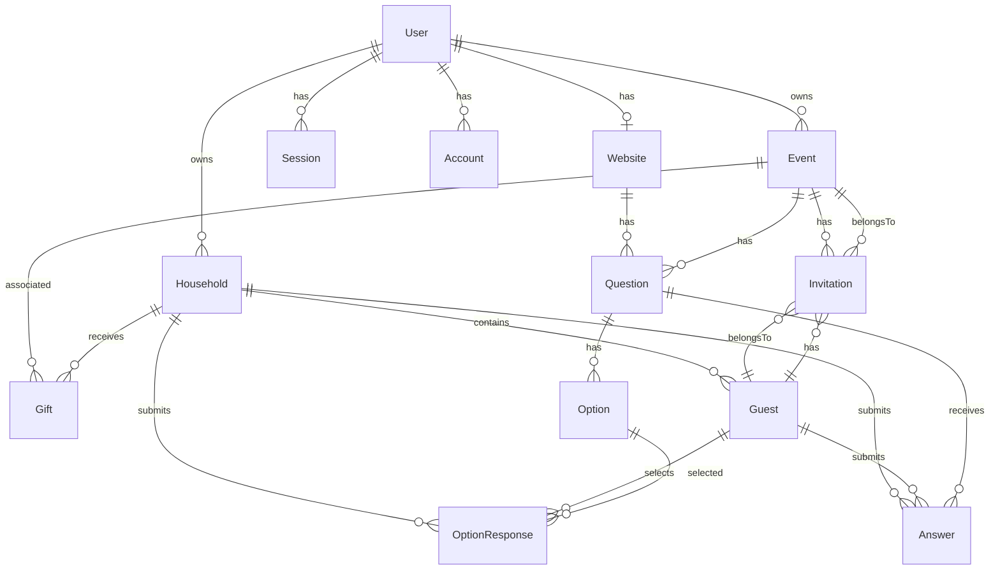

# Database Schema Documentation

## Overview

OSWP uses PostgreSQL with Prisma ORM. The schema supports wedding planning with user accounts, events, guests, RSVPs, and questions.

---

## Entity Relationship Diagram



---

## Models

### User (Better Auth)

Core user account managed by Better Auth.

```prisma
model User {
  id             String    @id
  name           String?
  email          String    @unique @db.VarChar(255)
  emailVerified  Boolean   @default(false)
  image          String?
  createdAt      DateTime  @default(now())
  updatedAt      DateTime  @updatedAt

  // Custom OSWP fields
  websiteUrl     String?   @db.VarChar(255)
  groomFirstName String?
  groomLastName  String?
  brideFirstName String?
  brideLastName  String?

  sessions       Session[]
  accounts       Account[]
}
```

| Field | Type | Description |
|-------|------|-------------|
| `id` | String | Primary key (set by Better Auth) |
| `email` | String | Unique email address |
| `emailVerified` | Boolean | Email verification status |
| `groomFirstName/LastName` | String? | Groom's name |
| `brideFirstName/LastName` | String? | Bride's name |

---

### Website

Wedding website configuration.

```prisma
model Website {
  id                String     @id @default(uuid())
  userId            String     @unique
  url               String     @unique
  subUrl            String     @unique
  groomFirstName    String
  groomLastName     String
  brideFirstName    String
  brideLastName     String
  isPasswordEnabled Boolean    @default(false)
  password          String?
  isRsvpEnabled     Boolean    @default(true)
  coverPhotoUrl     String?
  createdAt         DateTime   @default(now())
  updatedAt         DateTime   @updatedAt
  generalQuestions  Question[]
}
```

| Field | Type | Description |
|-------|------|-------------|
| `subUrl` | String | Custom URL slug (e.g., "john-and-jane") |
| `isPasswordEnabled` | Boolean | Password protection toggle |
| `isRsvpEnabled` | Boolean | RSVP feature toggle |
| `coverPhotoUrl` | String? | Wedding website banner image |

---

### Event

Wedding events (ceremony, reception, etc.).

```prisma
model Event {
  id          String       @id @default(uuid())
  name        String
  date        DateTime?    @db.Date
  startTime   String?
  endTime     String?
  venue       String?
  attire      String?
  description String?
  userId      String
  collectRsvp Boolean      @default(false)
  createdAt   DateTime     @default(now())
  updatedAt   DateTime     @updatedAt
  invitations Invitation[]
  gifts       Gift[]
  questions   Question[]
}
```

| Field | Type | Description |
|-------|------|-------------|
| `date` | DateTime? | Event date (date only, no time) |
| `startTime/endTime` | String? | Time strings (e.g., "2:00 PM") |
| `collectRsvp` | Boolean | Whether to collect RSVP for this event |

---

### Household

Guest groupings (families, couples, individuals).

```prisma
model Household {
  id             String           @id @default(uuid())
  userId         String
  address1       String?
  address2       String?
  city           String?
  state          String?
  zipCode        String?
  country        String?
  phone          String?
  email          String?
  notes          String?
  createdAt      DateTime         @default(now())
  updatedAt      DateTime         @updatedAt
  gifts          Gift[]
  guests         Guest[]
  answers        Answer[]
  optionReponses OptionResponse[]
}
```

| Field | Type | Description |
|-------|------|-------------|
| `userId` | String | Owner of this household record |
| `address1/2` | String? | Street address |
| `notes` | String? | Internal notes about household |

---

### Guest

Individual wedding guests.

```prisma
model Guest {
  id               Int              @id @default(autoincrement())
  firstName        String
  lastName         String
  householdId      String
  userId           String
  isPrimaryContact Boolean
  createdAt        DateTime         @default(now())
  updatedAt        DateTime         @updatedAt
  household        Household
  invitations      Invitation[]
  optionResponses  OptionResponse[]
  answers          Answer[]
}
```

| Field | Type | Description |
|-------|------|-------------|
| `id` | Int | Auto-incrementing ID |
| `isPrimaryContact` | Boolean | Primary contact for household |
| `householdId` | String | Foreign key to Household |

---

### Invitation

Links guests to events with RSVP status.

```prisma
model Invitation {
  guestId   Int
  eventId   String
  userId    String
  rsvp      String?  @default("Not Invited")
  invitedAt DateTime @default(now())
  updatedAt DateTime @updatedAt

  @@id([guestId, eventId])
}
```

| Field | Type | Description |
|-------|------|-------------|
| `rsvp` | String? | Status: "Not Invited", "Invited", "Attending", "Declined" |
| Composite PK | | `[guestId, eventId]` - unique per guest/event |

---

### Gift

Gift tracking per household per event.

```prisma
model Gift {
  householdId String
  eventId     String
  description String?
  thankyou    Boolean   @default(false)
  createdAt   DateTime  @default(now())
  updatedAt   DateTime  @updatedAt

  @@id([householdId, eventId])
}
```

| Field | Type | Description |
|-------|------|-------------|
| `description` | String? | Gift description |
| `thankyou` | Boolean | Thank you note sent status |
| Composite PK | | `[householdId, eventId]` |

---

### Question

RSVP questions (for events or website).

```prisma
model Question {
  id         String   @id @default(uuid())
  eventId    String?
  websiteId  String?
  text       String
  type       String   // 'Text' | 'Option'
  isRequired Boolean  @default(false)
  createdAt  DateTime @default(now())
  updatedAt  DateTime @updatedAt
  options    Option[]
  answers    Answer[]
}
```

| Field | Type | Description |
|-------|------|-------------|
| `eventId` | String? | Event-specific question (mutually exclusive with websiteId) |
| `websiteId` | String? | General website question |
| `type` | String | "Text" for free-text, "Option" for multiple choice |

---

### Option

Multiple choice options for questions.

```prisma
model Option {
  id              String           @id @default(uuid())
  questionId      String
  text            String
  description     String
  responseCount   Int              @default(0)
  createdAt       DateTime         @default(now())
  updatedAt       DateTime         @updatedAt
  optionResponses OptionResponse[]
}
```

| Field | Type | Description |
|-------|------|-------------|
| `responseCount` | Int | Cached count of selections |
| `description` | String | Additional option description |

---

### Answer

Text responses to questions.

```prisma
model Answer {
  questionId     String
  guestId        Int
  householdId    String
  response       String
  guestFirstName String?
  guestLastName  String?
  createdAt      DateTime @default(now())
  updatedAt      DateTime @updatedAt

  @@id([questionId, guestId, householdId])
}
```

| Field | Type | Description |
|-------|------|-------------|
| `response` | String | Text answer content |
| `guestFirstName/LastName` | String? | Denormalized guest name |

---

### OptionResponse

Multiple choice selections.

```prisma
model OptionResponse {
  questionId     String
  optionId       String
  guestId        Int
  householdId    String
  guestFirstName String?
  guestLastName  String?
  createdAt      DateTime @default(now())
  updatedAt      DateTime @updatedAt

  @@id([questionId, guestId, householdId])
}
```

---

## Indexes

Indexed fields for query performance:

| Model | Index Fields |
|-------|--------------|
| Session | `userId` |
| Account | `userId` |
| Gift | `householdId`, `eventId` |
| Guest | `householdId` |
| Question | `eventId`, `websiteId` |
| Option | `questionId` |
| OptionResponse | `questionId`, `optionId`, `guestId`, `householdId` |
| Answer | `guestId`, `householdId`, `questionId` |
| Invitation | `guestId`, `eventId` |

---

## Cascade Deletes

Cascade behavior for referential integrity:

| Parent | Child | On Delete |
|--------|-------|-----------|
| User | Session | Cascade |
| User | Account | Cascade |
| Household | Guest | Cascade |
| Household | Gift | Cascade |
| Event | Invitation | Cascade |
| Event | Gift | Cascade |
| Event | Question | Cascade |
| Website | Question | Cascade |
| Guest | Invitation | Cascade |
| Guest | Answer | Cascade |
| Guest | OptionResponse | Cascade |
| Question | Option | Cascade |
| Question | Answer | Cascade |
| Option | OptionResponse | Cascade |

---

## Commands

```bash
# Generate Prisma client
npx prisma generate

# Push schema to database
npx prisma db push

# Open Prisma Studio
npx prisma studio

# Create migration
npx prisma migrate dev --name migration_name
```
