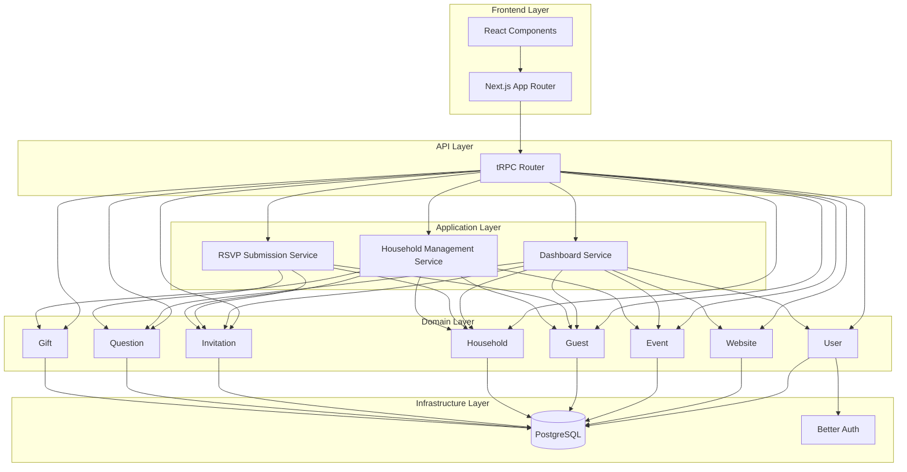

# The Open Source Wedding Project (OSWP)

## Overview

OSWP is a comprehensive, open-source wedding planning application built with a **domain-driven architecture**. It helps couples manage their wedding events, guest lists, RSVPs, and wedding website with a clean, maintainable codebase.

---

## Quick Links

| Resource | Description |
|----------|-------------|
| [Architecture Overview](./api/architecture.md) | System architecture and design patterns |
| [Domain Guide](./api/domains/README.md) | Business domain documentation |
| [Application Services](./api/application-services/README.md) | Cross-domain orchestration services |
| [Database Schema](./code/database/schema.md) | Prisma schema documentation |

---

## Technology Stack

| Layer | Technology |
|-------|------------|
| **Frontend** | Next.js 14 (App Router), React, TypeScript |
| **API** | tRPC v11, Zod validation |
| **Database** | PostgreSQL, Prisma ORM |
| **Authentication** | Better Auth |
| **Styling** | Tailwind CSS, shadcn/ui |
| **Testing** | Jest, React Testing Library |

---

## Architecture Overview



---

## Project Structure

```
src/
├── server/
│   ├── domains/              # Business domain modules
│   │   ├── user/
│   │   ├── website/
│   │   ├── event/
│   │   ├── guest/
│   │   ├── household/
│   │   ├── invitation/
│   │   ├── question/
│   │   └── gift/
│   │
│   ├── application/          # Cross-domain orchestration
│   │   ├── dashboard/
│   │   ├── rsvp-submission/
│   │   └── household-management/
│   │
│   ├── infrastructure/       # Technical services
│   │   └── database/
│   │
│   └── api/                  # tRPC setup
│       ├── root.ts
│       ├── trpc.ts
│       └── context.ts
│
├── app/                      # Next.js frontend
│   ├── dashboard/
│   ├── guest-list/
│   ├── auth/
│   └── _components/
│
└── lib/                      # Shared utilities
    ├── constants/
    ├── types/
    └── utils/
```

---

## Core Domains

| Domain | Description | Key Operations |
|--------|-------------|----------------|
| **User** | Couple account management | Profile updates |
| **Website** | Wedding website configuration | URL settings, password protection |
| **Event** | Wedding events/ceremonies | CRUD, RSVP settings |
| **Guest** | Individual guest management | CRUD, search |
| **Household** | Guest groups/addresses | CRUD, contact info |
| **Invitation** | Event invitations & RSVPs | RSVP tracking, status updates |
| **Question** | RSVP questions & responses | Event/Website questions |
| **Gift** | Gift tracking per household | Thank you tracking |

---

## Application Services

| Service | Purpose | Orchestrates |
|---------|---------|--------------|
| **Dashboard** | Aggregate overview data | All domains |
| **RSVP Submission** | Guest RSVP workflow | Household, Guest, Invitation, Question |
| **Household Management** | Complex household operations | Household, Guest, Invitation, Gift, Event |

---

## Getting Started

### Prerequisites

- Node.js 18+
- PostgreSQL database
- npm or yarn

### Installation

```bash
# Clone the repository
git clone https://github.com/dccakes/oswp.git

# Install dependencies
npm install

# Set up environment variables
cp .env.example .env

# Generate Prisma client
npx prisma generate

# Push database schema
npx prisma db push

# Start development server
npm run dev
```

### Running Tests

```bash
# Run unit tests
npm run test:unit

# Run linter
npm run lint
```

---

## License

This project is licensed under a non-commercial license. See the LICENSE file for details.
